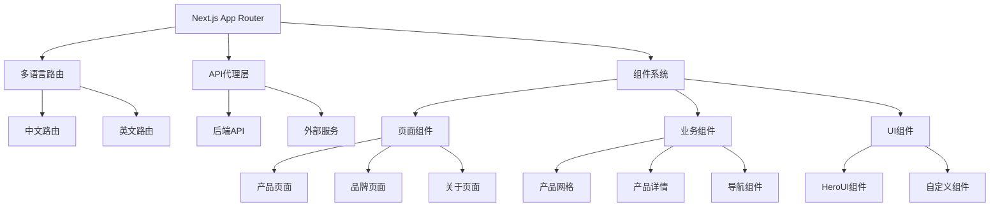
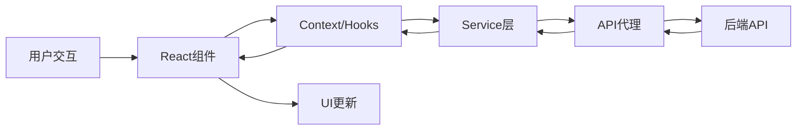

# TrendHub 前端架构文档

## 目录

- [概述](#概述)
- [技术栈](#技术栈)
- [项目结构](#项目结构)
- [架构设计](#架构设计)
- [路由系统](#路由系统)
- [组件架构](#组件架构)
- [状态管理](#状态管理)
- [样式系统](#样式系统)
- [国际化](#国际化)
- [API集成](#api集成)
- [性能优化](#性能优化)
- [部署配置](#部署配置)
- [开发指南](#开发指南)

## 概述

TrendHub 前端是一个基于 Next.js 15 的现代化电商前端应用，采用 App Router 架构，支持多语言、主题切换和响应式设计。应用专注于展示时尚产品，提供优秀的用户体验和高性能的页面加载。

### 核心特性

- 🚀 **现代化技术栈**: Next.js 15 + React 19 + TypeScript
- 🎨 **优秀的UI设计**: HeroUI 组件库 + Tailwind CSS
- 🌍 **国际化支持**: 中英文切换，语言路由
- 🌓 **主题系统**: 亮色/暗色模式，自动适配
- 📱 **响应式设计**: 移动端优先，适配所有设备
- ⚡ **高性能**: Turbopack 构建，组件懒加载
- 🔗 **API代理**: 统一API管理，错误处理
- 🎯 **产品为中心**: 产品展示、筛选、详情模态框

## 技术栈

### 核心框架

```json
{
  "next": "^15.3.3", // React全栈框架
  "react": "^19.1.0", // UI库
  "react-dom": "^19.1.0", // DOM操作
  "typescript": "5.8.3" // 类型系统
}
```

### UI和样式

```json
{
  "@heroui/react": "2.8.0-beta.7", // 现代化React组件库
  "tailwindcss": "4.1.10", // 原子化CSS框架
  "next-themes": "^0.4.6", // 主题管理
  "framer-motion": "12.18.1", // 动画库
  "lucide-react": "^0.516.0" // 图标库
}
```

### 状态管理和数据

```json
{
  "next-intl": "^4.1.0", // 国际化
  "react-slick": "^0.30.3", // 轮播组件
  "@prisma/client": "^6.9.0", // 数据库客户端
  "zod": "^3.24.4" // 数据验证
}
```

### 分析和监控

```json
{
  "@vercel/analytics": "^1.5.0", // 用户分析
  "@vercel/speed-insights": "^1.2.0" // 性能监控
}
```

### 开发工具

```json
{
  "eslint": "9.29.0", // 代码检查
  "prettier": "3.5.3", // 代码格式化
  "@swc/core": "^1.12.1" // 编译工具
}
```

## 项目结构

```
apps/web/
├── app/                      # Next.js App Router
│   ├── (redirect)/          # 重定向页面组
│   │   └── [locale]/
│   │       └── track-redirect/    # 产品跳转跟踪
│   ├── [locale]/            # 多语言路由
│   │   ├── [[...catchAll]]/ # 动态页面捕获
│   │   ├── about/           # 关于页面
│   │   ├── brands/          # 品牌页面
│   │   ├── product/         # 产品页面
│   │   └── layout.tsx       # 语言布局
│   ├── api/                 # API路由
│   │   └── newsletter/      # 邮件订阅
│   ├── layout.tsx           # 根布局
│   └── providers.tsx        # 全局Provider
├── components/              # React组件
│   ├── ui/                  # 基础UI组件
│   ├── product-detail/      # 产品详情组件
│   ├── navbar.tsx           # 导航栏
│   ├── footer.tsx           # 页脚
│   └── ...                  # 其他业务组件
├── contexts/                # React Context
│   ├── Providers.tsx        # Provider组合
│   ├── SettingsContext.tsx  # 设置Context
│   └── product-modal-context.tsx # 产品模态框Context
├── services/                # API服务
│   ├── brand.service.ts     # 品牌服务
│   └── product.service.ts   # 产品服务
├── types/                   # TypeScript类型
│   ├── index.ts            # 通用类型
│   └── product.ts          # 产品类型
├── lib/                     # 工具函数
│   ├── utils.ts            # 通用工具
│   └── mock-data.ts        # 模拟数据
├── config/                  # 配置文件
│   ├── site.ts             # 站点配置
│   └── colors.ts           # 颜色配置
├── i18n/                    # 国际化配置
│   ├── config.ts           # 语言配置
│   └── i18n.ts            # next-intl配置
├── messages/                # 翻译文件
│   ├── en.json             # 英文翻译
│   └── zh.json             # 中文翻译
├── styles/                  # 样式文件
│   └── globals.css         # 全局样式
├── docs/                    # 文档目录
├── next.config.js          # Next.js配置
├── tailwind.config.js      # Tailwind配置
├── tsconfig.json           # TypeScript配置
└── package.json            # 项目依赖
```

## 架构设计

### 整体架构



### 数据流架构



### 组件层次结构

```
App
├── Providers (全局状态提供者)
│   ├── NextThemesProvider (主题)
│   ├── HeroUIProvider (UI组件)
│   ├── SettingsProvider (设置)
│   └── ProductModalProvider (产品模态框)
├── MainNavbar (主导航)
├── 页面内容
│   ├── Banner (横幅)
│   ├── ProductGrid (产品网格)
│   ├── FeaturedBrands (特色品牌)
│   ├── LiveDeals (实时优惠)
│   └── TrendingSection (趋势区域)
└── Footer (页脚)
```

## 路由系统

### App Router 结构

TrendHub 使用 Next.js 15 的 App Router，采用文件系统路由：

```
app/
├── layout.tsx                    # 根布局
├── [locale]/                     # 语言参数路由
│   ├── layout.tsx               # 语言布局
│   ├── page.tsx                 # 首页
│   ├── [[...catchAll]]/         # 动态页面捕获
│   │   └── page.tsx            # CMS页面渲染
│   ├── about/                   # 静态页面
│   │   └── page.tsx
│   ├── brands/                  # 品牌路由
│   │   ├── page.tsx            # 品牌列表
│   │   └── [slug]/             # 动态品牌页
│   │       └── page.tsx
│   └── product/                 # 产品路由
│       ├── [id]/               # 产品详情
│       │   └── page.tsx
│       └── list/               # 产品列表
│           └── page.tsx
└── (redirect)/                  # 路由组
    └── [locale]/
        └── track-redirect/      # 跳转跟踪
```

### 国际化路由

使用 `next-intl` 实现多语言路由：

```typescript
// i18n/config.ts
export const locales = ['en', 'zh'] as const;
export const defaultLocale = 'zh' as const;
```

```typescript
// middleware.ts
const intlMiddleware = createMiddleware({
  locales,
  defaultLocale,
  localePrefix: 'always',
  localeDetection: true,
});
```

**路由示例**:

- `/zh/` - 中文首页
- `/en/` - 英文首页
- `/zh/brands/gucci` - 中文Gucci品牌页
- `/en/product/123` - 英文产品详情页

### 动态路由参数

```typescript
// 品牌页面参数
interface BrandPageParams {
  locale: string;
  slug: string;
}

// 产品页面参数
interface ProductPageParams {
  locale: string;
  id: string;
}

// 动态页面参数
interface CatchAllParams {
  locale: string;
  catchAll?: string[];
}
```

## 组件架构

### 组件分类

#### 1. 页面组件 (Pages)

- **位置**: `app/[locale]/*/page.tsx`
- **职责**: 页面级别的布局和数据获取
- **特点**: 服务端组件，SEO友好

```typescript
// app/[locale]/brands/page.tsx
export default function BrandsPage({
  params: { locale }
}: {
  params: { locale: string }
}) {
  return (
    <div>
      <BrandsClient locale={locale} />
    </div>
  );
}
```

#### 2. 布局组件 (Layouts)

- **位置**: `app/*/layout.tsx`
- **职责**: 页面结构、元数据、全局状态

```typescript
// app/[locale]/layout.tsx
export default async function LocaleLayout({
  children,
  params,
}: {
  children: React.ReactNode;
  params: { locale: string };
}) {
  const messages = await getMessages();

  return (
    <html lang={locale}>
      <body>
        <NextIntlClientProvider locale={locale} messages={messages}>
          <SettingsProvider initialSettings={settings}>
            <Providers>
              <MainNavbar />
              <main>{children}</main>
              <Footer />
            </Providers>
          </SettingsProvider>
        </NextIntlClientProvider>
      </body>
    </html>
  );
}
```

#### 3. 业务组件 (Business Components)

- **位置**: `components/`
- **职责**: 具体业务逻辑实现
- **特点**: 客户端组件，交互丰富

主要业务组件：

**产品相关组件**:

```typescript
// 产品网格组件
export const ProductGridRefined: React.FC<ProductGridRefinedProps> = ({ gender }) => {
  const [stores, setStores] = useState<Store[]>([]);
  const [activeStore, setActiveStore] = useState<StoreFilter>('all');

  // 从API获取真实产品数据
  // 从产品数据中提取商店信息
  // 实现商店筛选功能
};

// 产品详情模态框
export function ProductModalProvider({ children }: { children: ReactNode }) {
  const [selectedProduct, setSelectedProduct] = useState<ProductDetail | null>(null);

  const openProductModal = (product: ProductDetail) => {
    setSelectedProduct(product);
    setIsModalOpen(true);
  };
}
```

**导航组件**:

```typescript
// 主导航栏
export const MainNavbar: React.FC = () => {
  return (
    <NavbarProvider>
      <NavigationMenu>
        <LanguageSwitch />
        <ThemeSwitch />
        <NavbarBrands />
      </NavigationMenu>
    </NavbarProvider>
  );
};

// 品牌导航
export function NavbarBrands({ locale, onItemClick }: NavbarBrandsProps) {
  const [popularBrands, setPopularBrands] = useState<PublicBrand[]>([]);

  // 获取热门品牌数据
  // 按字母分组显示
};
```

#### 4. UI组件 (UI Components)

- **位置**: `components/ui/`
- **职责**: 可复用的基础UI组件
- **特点**: 无业务逻辑，高复用性

```typescript
// components/ui/toast.tsx
interface ToastProps {
  title: string;
  description?: string;
  variant?: 'success' | 'error' | 'warning' | 'info';
}

export const Toast: React.FC<ToastProps> = ({ title, description, variant }) => {
  return (
    <div className={cn('toast-base', toastVariants({ variant }))}>
      <h4>{title}</h4>
      {description && <p>{description}</p>}
    </div>
  );
};
```

### 组件设计原则

#### 1. 单一职责原则

每个组件只负责一个功能：

```typescript
// ❌ 违反单一职责
const ProductPageComponent = () => {
  // 产品数据获取
  // 用户认证检查
  // 页面SEO设置
  // UI渲染
};

// ✅ 符合单一职责
const ProductDetail = ({ product }) => {
  // 只负责产品详情UI渲染
};

const useProductData = (id) => {
  // 只负责产品数据获取
};
```

#### 2. 组件组合

通过组合构建复杂功能：

```typescript
// 产品页面组合
export default function ProductPage({ params }: { params: { id: string } }) {
  return (
    <div>
      <ProductBreadcrumbs />
      <ProductDetail productId={params.id} />
      <RelatedProducts />
      <ProductReviews />
    </div>
  );
}
```

#### 3. Props接口设计

清晰的接口定义：

```typescript
// 产品卡片接口
interface ProductCardProps {
  product: Product;
  onAddToCart?: (product: Product) => void;
  onAddToWishlist?: (product: Product) => void;
  showDiscount?: boolean;
  size?: 'small' | 'medium' | 'large';
  className?: string;
}

// 使用示例
<ProductCard
  product={product}
  onAddToCart={handleAddToCart}
  showDiscount={true}
  size="medium"
/>
```

## 状态管理

TrendHub 使用 React Context API 进行状态管理，采用分层式Context设计：

### Context层次结构

```typescript
// 1. 设置Context - 全局配置
interface SettingsContextState {
  settings: Record<string, string>; // 网站设置
  snippets: CodeSnippet[]; // 代码片段
  isLoading: boolean; // 加载状态
}

// 2. 主题Context - 由next-themes提供
// 自动处理亮色/暗色模式切换

// 3. 产品模态框Context - 产品详情展示
interface ProductModalContextType {
  openProductModal: (product: ProductDetail) => void;
  closeProductModal: () => void;
  isModalOpen: boolean;
  selectedProduct: ProductDetail | null;
}

// 4. HeroUI Context - UI组件状态
// 由@heroui/react提供
```

### Context使用模式

#### 1. Provider组合模式

```typescript
// contexts/Providers.tsx
export function Providers({ children }: { children: ReactNode }) {
  return (
    <NextThemesProvider
      enableSystem
      attribute="class"
      defaultTheme="system"
      themes={['light', 'dark']}
    >
      <HeroUIProvider>
        <ProductModalProvider>
          {children}
          <ToastProvider />
          <Analytics />
          <SpeedInsights />
        </ProductModalProvider>
      </HeroUIProvider>
    </NextThemesProvider>
  );
}
```

#### 2. 自定义Hook模式

```typescript
// 设置Hook
export function useSettings(): SettingsContextState {
  const context = useContext(SettingsContext);

  if (context === undefined) {
    throw new Error('useSettings 必须在 SettingsProvider 内部使用');
  }

  return context;
}

// 产品模态框Hook
export function useProductModal() {
  const context = useContext(ProductModalContext);

  if (context === undefined) {
    throw new Error('useProductModal must be used within a ProductModalProvider');
  }

  return context;
}
```

#### 3. 组件中使用Context

```typescript
// 在组件中使用设置
const MyComponent: React.FC = () => {
  const { settings, isLoading } = useSettings();
  const siteName = settings.siteName || 'TrendHub';

  if (isLoading) {
    return <div>Loading...</div>;
  }

  return <h1>{siteName}</h1>;
};

// 在组件中使用产品模态框
const ProductCard: React.FC<{ product: Product }> = ({ product }) => {
  const { openProductModal } = useProductModal();

  const handleClick = () => {
    openProductModal(product);
  };

  return (
    <div onClick={handleClick}>
      {/* 产品卡片内容 */}
    </div>
  );
};
```

### 状态管理最佳实践

#### 1. 最小化状态提升

```typescript
// ❌ 过度提升状态
const App = () => {
  const [searchTerm, setSearchTerm] = useState('');
  const [filters, setFilters] = useState({});
  // 这些状态只在ProductList中使用，不应该提升到App级别
};

// ✅ 适当的状态层级
const ProductListPage = () => {
  const [searchTerm, setSearchTerm] = useState('');
  const [filters, setFilters] = useState({});
  // 状态保持在需要使用的组件层级
};
```

#### 2. Context性能优化

```typescript
// 使用useMemo优化Context值
export function SettingsProvider({ children, initialSettings }: SettingsProviderProps) {
  const [settings] = useState<Record<string, string>>(initialSettings);
  const [isLoading] = useState(false);

  const value = useMemo(
    () => ({
      settings,
      snippets,
      isLoading,
    }),
    [settings, snippets, isLoading]
  );

  return <SettingsContext.Provider value={value}>{children}</SettingsContext.Provider>;
}
```

#### 3. 错误边界处理

```typescript
// Context错误处理
export function useSettings(): SettingsContextState {
  const context = useContext(SettingsContext);

  if (context === undefined) {
    throw new Error('useSettings 必须在 SettingsProvider 内部使用');
  }

  return context;
}
```

## 样式系统

TrendHub 采用 Tailwind CSS 4.x + HeroUI 的现代化样式系统：

### 样式架构

```
styles/
├── globals.css              # 全局样式和主题变量
├── components/              # 组件样式 (如需要)
└── utilities/               # 自定义工具类
```

### 主题系统

#### 1. 颜色系统设计

```typescript
// config/colors.ts - 颜色配置
export const colors = {
  light: {
    background: {
      primary: '#FFFFFF', // 主背景色
      secondary: '#FAF9F6', // 次背景色
      tertiary: '#F5F5F2', // 三级背景色
    },
    text: {
      primary: '#1A1A1A', // 主文字色
      secondary: '#666666', // 次文字色
      tertiary: '#999999', // 三级文字色
    },
    border: {
      primary: '#E8E6E3', // 主边框色
      secondary: '#F0F0F0', // 次边框色
    },
    hover: {
      background: '#F5F5F2', // 悬停背景色
      text: '#1A1A1A', // 悬停文字色
    },
  },
  dark: {
    background: {
      primary: '#0A0A0A', // 深色主背景
      secondary: '#121212', // 深色次背景
      tertiary: '#1A1A1A', // 深色三级背景
    },
    text: {
      primary: '#FFFFFF', // 深色主文字
      secondary: '#B3B3B3', // 深色次文字
      tertiary: '#808080', // 深色三级文字
    },
    // ... 更多深色配色
  },
};
```

#### 2. CSS变量系统

```css
/* styles/globals.css */
@theme {
  /* 自定义颜色变量 */
  --color-bg-primary-light: #ffffff;
  --color-bg-primary-dark: #0a0a0a;
  --color-text-primary-light: #1a1a1a;
  --color-text-primary-dark: #ffffff;
}

/* HeroUI主题变量 */
:root {
  --primary-500: #0080ff;
  --secondary-500: #8b5cf6;
  --success-500: #22c55e;
  --warning-500: #f59e0b;
  --danger-500: #ef4444;
}

.dark {
  --primary-500: #3d9aff;
  --secondary-500: #a683ff;
  /* ... 深色模式变量 */
}
```

#### 3. Tailwind配置集成

```javascript
// tailwind.config.js
export default {
  content: [
    './app/**/*.{js,ts,jsx,tsx,mdx}',
    './components/**/*.{js,ts,jsx,tsx,mdx}',
    '../../node_modules/@heroui/theme/dist/**/*.{js,ts,jsx,tsx}',
  ],
  theme: {
    extend: {
      colors: {
        // 自定义颜色类
        'bg-primary': {
          light: colors.light.background.primary,
          dark: colors.dark.background.primary,
          DEFAULT: colors.light.background.primary,
        },
        'text-primary': {
          light: colors.light.text.primary,
          dark: colors.dark.text.primary,
          DEFAULT: colors.light.text.primary,
        },
      },
    },
  },
  darkMode: 'class',
  plugins: [
    heroui({
      themes: {
        light: {
          /* 亮色主题配置 */
        },
        dark: {
          /* 深色主题配置 */
        },
      },
    }),
  ],
};
```

### 组件样式规范

#### 1. 样式组织方式

```typescript
// 优先使用Tailwind类
const ProductCard: React.FC = () => {
  return (
    <div className="bg-white dark:bg-gray-800 rounded-lg shadow-sm hover:shadow-md transition-shadow">
      <div className="p-4">
        <h3 className="text-lg font-semibold text-gray-900 dark:text-gray-100">
          产品标题
        </h3>
        <p className="text-sm text-gray-600 dark:text-gray-400 mt-2">
          产品描述
        </p>
      </div>
    </div>
  );
};
```

#### 2. 条件样式处理

```typescript
// 使用clsx或cn函数处理条件样式
import { cn } from '@/lib/utils';

interface ButtonProps {
  variant: 'primary' | 'secondary' | 'danger';
  size: 'sm' | 'md' | 'lg';
  disabled?: boolean;
}

const Button: React.FC<ButtonProps> = ({ variant, size, disabled, children }) => {
  return (
    <button
      className={cn(
        // 基础样式
        "rounded font-medium transition-colors",
        // 变体样式
        {
          'bg-blue-500 text-white hover:bg-blue-600': variant === 'primary',
          'bg-gray-200 text-gray-900 hover:bg-gray-300': variant === 'secondary',
          'bg-red-500 text-white hover:bg-red-600': variant === 'danger',
        },
        // 尺寸样式
        {
          'px-2 py-1 text-sm': size === 'sm',
          'px-4 py-2': size === 'md',
          'px-6 py-3 text-lg': size === 'lg',
        },
        // 状态样式
        {
          'opacity-50 cursor-not-allowed': disabled,
        }
      )}
      disabled={disabled}
    >
      {children}
    </button>
  );
};
```

#### 3. 响应式设计

```typescript
// 移动端优先的响应式设计
const ResponsiveGrid: React.FC = () => {
  return (
    <div className="grid grid-cols-1 sm:grid-cols-2 lg:grid-cols-3 xl:grid-cols-4 gap-4">
      {/* 移动端1列，小屏2列，大屏3列，超大屏4列 */}
    </div>
  );
};

// 响应式间距和字体
const ResponsiveCard: React.FC = () => {
  return (
    <div className="p-4 sm:p-6 lg:p-8">
      <h2 className="text-lg sm:text-xl lg:text-2xl font-bold">
        响应式标题
      </h2>
    </div>
  );
};
```

### 主题切换实现

#### 1. 主题Provider配置

```typescript
// app/providers.tsx
export function Providers({ children }: { children: ReactNode }) {
  return (
    <NextThemesProvider
      enableSystem                    // 启用系统主题检测
      attribute="class"              // 使用class属性控制主题
      defaultTheme="system"          // 默认跟随系统
      themes={['light', 'dark']}     // 支持的主题列表
    >
      <HeroUIProvider>
        {children}
      </HeroUIProvider>
    </NextThemesProvider>
  );
}
```

#### 2. 主题切换组件

```typescript
// components/theme-switch.tsx
import { useTheme } from 'next-themes';

export const ThemeSwitch: React.FC = () => {
  const { theme, setTheme } = useTheme();

  return (
    <Button
      variant="ghost"
      size="sm"
      onClick={() => setTheme(theme === 'light' ? 'dark' : 'light')}
    >
      {theme === 'light' ? <Moon /> : <Sun />}
    </Button>
  );
};
```

#### 3. 主题感知样式

```typescript
// 组件中使用主题感知样式
const ThemedComponent: React.FC = () => {
  return (
    <div className="bg-bg-primary-light dark:bg-bg-primary-dark">
      <h1 className="text-text-primary-light dark:text-text-primary-dark">
        主题感知文本
      </h1>
      <div className="border border-border-primary-light dark:border-border-primary-dark">
        主题感知边框
      </div>
    </div>
  );
};
```

## 国际化

TrendHub 使用 `next-intl` 实现完整的国际化支持：

### 国际化架构

```
i18n/
├── config.ts                # 语言配置
├── i18n.ts                 # next-intl配置
└── index.ts                # 导出文件

messages/
├── en.json                 # 英文翻译
└── zh.json                 # 中文翻译
```

### 配置设置

#### 1. 语言配置

```typescript
// i18n/config.ts
export const locales = ['en', 'zh'] as const;
export const defaultLocale = 'zh' as const;
export type Locale = (typeof locales)[number];
```

#### 2. next-intl配置

```typescript
// i18n/i18n.ts
import { notFound } from 'next/navigation';
import { getRequestConfig } from 'next-intl/server';
import { locales } from './config';

export default getRequestConfig(async ({ locale }) => {
  if (!locales.includes(locale as any)) notFound();

  return {
    messages: (await import(`../messages/${locale}.json`)).default,
  };
});
```

#### 3. 中间件配置

```typescript
// middleware.ts
import createMiddleware from 'next-intl/middleware';
import { locales, defaultLocale } from './i18n/config';

const intlMiddleware = createMiddleware({
  locales,
  defaultLocale,
  localePrefix: 'always', // URL中始终显示语言前缀
  localeDetection: true, // 启用语言检测
});

export default function middleware(request: NextRequest) {
  // 跳过静态资源和API路由
  if (
    request.nextUrl.pathname.startsWith('/_next') ||
    request.nextUrl.pathname.startsWith('/api') ||
    request.nextUrl.pathname.includes('.')
  ) {
    return NextResponse.next();
  }

  return intlMiddleware(request);
}
```

### 翻译文件结构

#### 1. 层次化组织

```json
// messages/zh.json
{
  "nav": {
    "home": "首页",
    "products": "产品",
    "brands": "品牌",
    "about": "关于我们"
  },
  "productGrid": {
    "title": "热门产品",
    "subtitle": "发现最新时尚趋势",
    "newArrival": "新品",
    "addToCart": "加入购物车",
    "errors": {
      "fetchError": "获取产品失败",
      "loadError": "加载失败"
    }
  },
  "common": {
    "loading": "加载中...",
    "error": "错误",
    "retry": "重试",
    "close": "关闭"
  }
}
```

```json
// messages/en.json
{
  "nav": {
    "home": "Home",
    "products": "Products",
    "brands": "Brands",
    "about": "About Us"
  },
  "productGrid": {
    "title": "Featured Products",
    "subtitle": "Discover the latest fashion trends",
    "newArrival": "New",
    "addToCart": "Add to Cart",
    "errors": {
      "fetchError": "Failed to fetch products",
      "loadError": "Loading failed"
    }
  },
  "common": {
    "loading": "Loading...",
    "error": "Error",
    "retry": "Retry",
    "close": "Close"
  }
}
```

### 使用方式

#### 1. 在组件中使用翻译

```typescript
// 基础用法
import { useTranslations } from 'next-intl';

const ProductCard: React.FC = () => {
  const t = useTranslations('productGrid');

  return (
    <div>
      <h3>{t('title')}</h3>
      <button>{t('addToCart')}</button>
    </div>
  );
};

// 带参数的翻译
const WelcomeMessage: React.FC<{ userName: string }> = ({ userName }) => {
  const t = useTranslations('common');

  return (
    <p>{t('welcome', { name: userName })}</p>
  );
};
```

#### 2. 服务端组件使用

```typescript
// 在服务端组件中使用翻译
import { getTranslations } from 'next-intl/server';

export default async function ServerComponent({
  params: { locale }
}: {
  params: { locale: string }
}) {
  const t = await getTranslations('nav');

  return (
    <nav>
      <a href={`/${locale}`}>{t('home')}</a>
      <a href={`/${locale}/products`}>{t('products')}</a>
    </nav>
  );
}
```

#### 3. 动态翻译和错误处理

```typescript
// 带默认值的翻译
const SafeTranslation: React.FC = () => {
  const t = useTranslations('productGrid');

  // 如果翻译键不存在，使用默认值
  const title = t('title', { defaultValue: 'Products' });

  return <h1>{title}</h1>;
};

// 错误处理
const ErrorBoundaryComponent: React.FC = () => {
  const t = useTranslations('common');

  try {
    return <div>{t('content')}</div>;
  } catch (error) {
    return <div>{t('error', { defaultValue: 'Something went wrong' })}</div>;
  }
};
```

### 语言切换

#### 1. 语言切换组件

```typescript
// components/language-switch.tsx
import { useRouter, usePathname } from 'next/navigation';
import { useLocale } from 'next-intl';

export const LanguageSwitch: React.FC = () => {
  const router = useRouter();
  const pathname = usePathname();
  const locale = useLocale();

  const switchLanguage = (newLocale: string) => {
    // 替换URL中的语言前缀
    const newPath = pathname.replace(`/${locale}`, `/${newLocale}`);
    router.push(newPath);
  };

  return (
    <div className="flex gap-2">
      <button
        onClick={() => switchLanguage('zh')}
        className={cn(
          'px-2 py-1 rounded',
          locale === 'zh' ? 'bg-blue-500 text-white' : 'bg-gray-200'
        )}
      >
        中文
      </button>
      <button
        onClick={() => switchLanguage('en')}
        className={cn(
          'px-2 py-1 rounded',
          locale === 'en' ? 'bg-blue-500 text-white' : 'bg-gray-200'
        )}
      >
        English
      </button>
    </div>
  );
};
```

#### 2. 路由链接国际化

```typescript
// 国际化链接组件
import Link from 'next/link';
import { useLocale } from 'next-intl';

interface LocalizedLinkProps {
  href: string;
  children: React.ReactNode;
  className?: string;
}

export const LocalizedLink: React.FC<LocalizedLinkProps> = ({
  href,
  children,
  className
}) => {
  const locale = useLocale();

  return (
    <Link href={`/${locale}${href}`} className={className}>
      {children}
    </Link>
  );
};

// 使用示例
<LocalizedLink href="/products">
  {t('nav.products')}
</LocalizedLink>
```

### SEO和元数据国际化

#### 1. 多语言元数据

```typescript
// app/[locale]/layout.tsx
export async function generateMetadata({
  params,
}: {
  params: { locale: string };
}): Promise<Metadata> {
  const t = await getTranslations('metadata');

  return {
    title: {
      default: t('title'),
      template: `%s | ${t('siteName')}`,
    },
    description: t('description'),
    openGraph: {
      title: t('title'),
      description: t('description'),
      locale: params.locale,
    },
  };
}
```

#### 2. 结构化数据国际化

```typescript
// 产品页面结构化数据
const generateProductSchema = (product: Product, locale: string) => {
  return {
    '@context': 'https://schema.org',
    '@type': 'Product',
    name: product.name,
    description: product.description,
    url: `https://example.com/${locale}/product/${product.id}`,
    offers: {
      '@type': 'Offer',
      price: product.price,
      priceCurrency: locale === 'zh' ? 'CNY' : 'USD',
    },
  };
};
```

## API集成

TrendHub 通过 API 代理层与后端服务集成：

### API架构

```
前端应用 → API代理 → 后端服务
    ↓         ↓         ↓
  next.js   rewrite   admin app
   3000      3000      3001
```

### API代理配置

#### 1. Next.js配置

```javascript
// next.config.js
const nextConfig = {
  async rewrites() {
    return [
      {
        source: '/api/public/:path*',
        destination: 'http://localhost:3001/api/public/:path*',
      },
    ];
  },
};
```

#### 2. API服务层

```typescript
// services/brand.service.ts
export async function getBrands(params: BrandQueryParams = {}): Promise<BrandListResponse> {
  try {
    const searchParams = new URLSearchParams();

    if (params.page) searchParams.append('page', params.page.toString());
    if (params.limit) searchParams.append('limit', params.limit.toString());
    if (params.search) searchParams.append('search', params.search);
    if (params.withProducts !== undefined)
      searchParams.append('withProducts', params.withProducts.toString());

    searchParams.append('isActive', 'true');

    // 环境检测：SSR vs CSR
    let url: string;
    if (typeof window === 'undefined') {
      // 服务端渲染：使用完整URL
      url = `http://localhost:3001/api/public/brands?${searchParams.toString()}`;
    } else {
      // 客户端渲染：使用相对路径
      url = `/api/public/brands?${searchParams.toString()}`;
    }

    const response = await fetch(url);

    if (!response.ok) {
      throw new Error(`获取品牌失败: ${response.status}`);
    }

    return await response.json();
  } catch (error) {
    console.error('Brand service error:', error);
    return {
      items: [],
      pagination: { total: 0, page: 1, limit: 10, totalPages: 0 },
    };
  }
}
```

### API使用模式

#### 1. 数据获取Hook

```typescript
// hooks/use-products.ts
export function useProducts(params: ProductQueryParams) {
  const [products, setProducts] = useState<Product[]>([]);
  const [loading, setLoading] = useState(true);
  const [error, setError] = useState<string | null>(null);

  useEffect(() => {
    const fetchProducts = async () => {
      setLoading(true);
      setError(null);

      try {
        const response = await fetch('/api/public/products?' + new URLSearchParams(params));

        if (!response.ok) {
          throw new Error(`HTTP ${response.status}`);
        }

        const data = await response.json();
        setProducts(data.data || []);
      } catch (err) {
        setError(err instanceof Error ? err.message : '获取数据失败');
      } finally {
        setLoading(false);
      }
    };

    fetchProducts();
  }, [params]);

  return { products, loading, error };
}
```

#### 2. 组件中使用API

```typescript
// 产品网格组件中的API集成
export const ProductGridRefined: React.FC<ProductGridRefinedProps> = ({ gender }) => {
  const [productsToDisplay, setProductsToDisplay] = useState<ProductWithRetailer[]>([]);
  const [stores, setStores] = useState<Store[]>([{ id: 'all', name: 'All Stores', active: true }]);
  const [isLoading, setIsLoading] = useState(true);
  const [error, setError] = useState<string | null>(null);

  useEffect(() => {
    const fetchContentBlock = async () => {
      setIsLoading(true);
      setError(null);

      try {
        // 1. 获取内容块配置
        const contentBlockResponse = await fetch(
          '/api/public/content-blocks?type=PRODUCT_GRID_CONFIGURABLE'
        );
        let blockData = null;
        if (contentBlockResponse.ok) {
          blockData = await contentBlockResponse.json();
        }

        // 2. 根据配置构建产品API请求
        const params = new URLSearchParams();
        if (blockData?.data?.productLimit) {
          params.append('limit', blockData.data.productLimit.toString());
        } else {
          params.append('limit', '24');
        }

        if (gender) {
          params.append('gender', gender);
        }

        // 3. 获取产品数据
        const productResponse = await fetch(`/api/public/products?${params.toString()}`);
        if (!productResponse.ok) {
          throw new Error(`API request failed: ${productResponse.status}`);
        }

        const result = await productResponse.json();
        const realProducts = result.data || [];

        // 4. 从产品数据中提取商店信息
        const uniqueSources = new Set<string>();
        realProducts.forEach((product: any) => {
          if (product.source) {
            uniqueSources.add(product.source);
          }
        });

        // 5. 构建商店列表
        const realStores: Store[] = [{ id: 'all', name: 'All Stores', active: true }];

        Array.from(uniqueSources)
          .sort()
          .forEach((source) => {
            realStores.push({
              id: source as StoreFilter,
              name: sourceNameMap[source] || source.charAt(0).toUpperCase() + source.slice(1),
              active: false,
            });
          });

        setStores(realStores);
        setProductsToDisplay(
          realProducts.map((product: any) => ({
            ...product,
            retailer: product.source || ('unknown' as StoreFilter),
          }))
        );
      } catch (err: unknown) {
        console.error('Failed to fetch real products:', err);
        setError(err instanceof Error ? err.message : '获取数据失败');
        // 回退到mock数据
        setProductsToDisplay(mockProducts);
      } finally {
        setIsLoading(false);
      }
    };

    fetchContentBlock();
  }, [gender]);

  // 组件渲染逻辑...
};
```

#### 3. 错误处理和重试

```typescript
// 带重试机制的API调用
const fetchWithRetry = async (
  url: string,
  options: RequestInit = {},
  retries = 3
): Promise<Response> => {
  for (let i = 0; i < retries; i++) {
    try {
      const response = await fetch(url, {
        ...options,
        timeout: 10000, // 10秒超时
      });

      if (response.ok) {
        return response;
      }

      if (response.status >= 400 && response.status < 500) {
        // 客户端错误，不重试
        throw new Error(`Client error: ${response.status}`);
      }

      if (i === retries - 1) {
        throw new Error(`Server error: ${response.status}`);
      }
    } catch (error) {
      if (i === retries - 1) {
        throw error;
      }

      // 等待后重试
      await new Promise((resolve) => setTimeout(resolve, 1000 * Math.pow(2, i)));
    }
  }

  throw new Error('Max retries exceeded');
};
```

### API类型定义

#### 1. 响应类型

```typescript
// types/api.ts
export interface ApiResponse<T> {
  data: T;
  success: boolean;
  message?: string;
}

export interface PaginatedResponse<T> {
  items: T[];
  pagination: {
    total: number;
    page: number;
    limit: number;
    totalPages: number;
  };
}

// 产品API响应
export interface ProductListResponse extends PaginatedResponse<Product> {}

// 品牌API响应
export interface BrandListResponse extends PaginatedResponse<Brand> {}
```

#### 2. 请求参数类型

```typescript
// API请求参数类型
export interface ProductQueryParams {
  page?: number;
  limit?: number;
  category?: string;
  brand?: string;
  gender?: 'women' | 'men' | 'unisex';
  sale?: boolean;
  minPrice?: number;
  maxPrice?: number;
  sort?: 'name' | 'price' | 'createdAt';
  order?: 'asc' | 'desc';
  search?: string;
  ids?: string[];
}

export interface BrandQueryParams {
  page?: number;
  limit?: number;
  search?: string;
  letter?: string;
  popularity?: boolean;
  withProducts?: boolean;
  sortBy?: string;
  sortOrder?: 'asc' | 'desc';
}
```

## 性能优化

TrendHub 实施了多层次的性能优化策略：

### 构建优化

#### 1. Next.js配置优化

```javascript
// next.config.js
const nextConfig = {
  // 启用严格模式
  reactStrictMode: true,

  // 使用SWC编译器
  swcMinify: true,

  // 启用Turbopack（开发环境）
  experimental: {
    turbo: {
      resolveAlias: {
        '@': './src',
      },
    },
    optimizeCss: true,
    scrollRestoration: true,
  },

  // 图片优化
  images: {
    formats: ['image/avif', 'image/webp'],
    deviceSizes: [640, 750, 828, 1080, 1200, 1920, 2048, 3840],
    imageSizes: [16, 32, 48, 64, 96, 128, 256, 384],
  },

  // 压缩和优化
  compress: true,
  poweredByHeader: false,
};
```

#### 2. 包分析和优化

```bash
# 包分析
npm run build -- --analyze

# 构建优化检查
npm run build && npm run start
```

### 组件优化

#### 1. 懒加载和代码分割

```typescript
// 动态导入重型组件
const ProductModal = dynamic(() => import('./product-modal'), {
  loading: () => <div>Loading...</div>,
  ssr: false, // 客户端渲染
});

const ChartComponent = dynamic(() => import('./chart-component'), {
  loading: () => <Skeleton className="h-64 w-full" />,
});

// 路由级别的代码分割自动处理
// app/products/page.tsx 会自动分割为独立的chunk
```

#### 2. 组件优化模式

```typescript
// React.memo优化
const ProductCard = React.memo<ProductCardProps>(({ product, onAddToCart }) => {
  return (
    <div className="product-card">
      <h3>{product.name}</h3>
      <p>{product.price}</p>
      <button onClick={() => onAddToCart?.(product)}>
        Add to Cart
      </button>
    </div>
  );
}, (prevProps, nextProps) => {
  // 自定义比较函数
  return prevProps.product.id === nextProps.product.id &&
         prevProps.product.price === nextProps.product.price;
});

// useMemo优化昂贵计算
const ExpensiveComponent: React.FC<{ products: Product[] }> = ({ products }) => {
  const expensiveValue = useMemo(() => {
    return products
      .filter(p => p.price > 1000)
      .sort((a, b) => b.price - a.price)
      .slice(0, 10);
  }, [products]);

  return <div>{/* 渲染逻辑 */}</div>;
};

// useCallback优化函数引用
const ProductList: React.FC = () => {
  const [products, setProducts] = useState<Product[]>([]);

  const handleAddToCart = useCallback((product: Product) => {
    // 添加到购物车逻辑
    console.log('Added to cart:', product.id);
  }, []);

  return (
    <div>
      {products.map(product => (
        <ProductCard
          key={product.id}
          product={product}
          onAddToCart={handleAddToCart}
        />
      ))}
    </div>
  );
};
```

#### 3. 虚拟化处理大列表

```typescript
// 使用react-window处理大量产品列表
import { FixedSizeList as List } from 'react-window';

const VirtualizedProductList: React.FC<{ products: Product[] }> = ({ products }) => {
  const Row = ({ index, style }: { index: number; style: React.CSSProperties }) => (
    <div style={style}>
      <ProductCard product={products[index]} />
    </div>
  );

  return (
    <List
      height={600}        // 列表高度
      itemCount={products.length}
      itemSize={200}      // 每项高度
      width="100%"
    >
      {Row}
    </List>
  );
};
```

### 图片优化

#### 1. Next.js Image组件

```typescript
import Image from 'next/image';

// 优化的产品图片组件
const ProductImage: React.FC<{ product: Product }> = ({ product }) => {
  return (
    <div className="relative aspect-square">
      <Image
        src={product.images[0] || '/images/placeholder.jpg'}
        alt={product.name}
        fill                    // 填充父容器
        sizes="(max-width: 768px) 100vw, (max-width: 1200px) 50vw, 33vw"
        className="object-cover object-center"
        priority={false}        // 非关键图片
        placeholder="blur"      // 模糊占位符
        blurDataURL="data:image/jpeg;base64,/9j/4AAQSkZJRgABAQAAAQ..."
      />
    </div>
  );
};

// 英雄图片（关键图片）
const HeroImage: React.FC = () => {
  return (
    <Image
      src="/images/hero-banner.jpg"
      alt="Hero Banner"
      width={1920}
      height={1080}
      priority={true}         // 关键图片，优先加载
      className="w-full h-auto"
    />
  );
};
```

#### 2. 响应式图片

```typescript
// 响应式图片组件
const ResponsiveImage: React.FC<{
  src: string;
  alt: string;
  className?: string;
}> = ({ src, alt, className }) => {
  return (
    <picture>
      <source
        srcSet={`${src}?w=640&f=avif 640w, ${src}?w=1280&f=avif 1280w`}
        type="image/avif"
      />
      <source
        srcSet={`${src}?w=640&f=webp 640w, ${src}?w=1280&f=webp 1280w`}
        type="image/webp"
      />
      
    </picture>
  );
};
```

### 缓存策略

#### 1. API缓存

```typescript
// SWR数据获取和缓存
import useSWR from 'swr';

const fetcher = (url: string) => fetch(url).then((res) => res.json());

export function useProducts(params: ProductQueryParams) {
  const key = `/api/products?${new URLSearchParams(params)}`;

  const { data, error, mutate } = useSWR(key, fetcher, {
    revalidateOnFocus: false,
    revalidateOnReconnect: false,
    refreshInterval: 5 * 60 * 1000, // 5分钟刷新
  });

  return {
    products: data?.data || [],
    loading: !error && !data,
    error,
    mutate,
  };
}
```

#### 2. 浏览器缓存

```typescript
// 服务端API缓存配置
export async function GET(request: Request) {
  const response = await fetch('http://backend/api/products');
  const data = await response.json();

  return NextResponse.json(data, {
    headers: {
      // 缓存1小时
      'Cache-Control': 'public, s-maxage=3600, stale-while-revalidate=86400',
    },
  });
}
```

### 监控和分析

#### 1. 性能监控

```typescript
// 性能监控集成
import { Analytics } from '@vercel/analytics/react';
import { SpeedInsights } from '@vercel/speed-insights/react';

export function Providers({ children }: { children: ReactNode }) {
  return (
    <div>
      {children}
      <Analytics />
      <SpeedInsights />
    </div>
  );
}
```

#### 2. Web Vitals追踪

```typescript
// app/layout.tsx
export function reportWebVitals(metric: any) {
  // 发送到分析服务
  if (process.env.NODE_ENV === 'production') {
    // Google Analytics
    gtag('event', metric.name, {
      value: Math.round(metric.value),
      event_label: metric.id,
    });
  }
}
```

## 部署配置

### 环境配置

#### 1. 环境变量

```bash
# .env.local
NEXT_PUBLIC_SITE_URL=https://trendhub.example.com
NEXT_PUBLIC_ADMIN_API_URL=http://localhost:3001
NEXT_PUBLIC_ANALYTICS_ID=GA_TRACKING_ID
```

#### 2. PM2配置

```json
// ecosystem.config.json
{
  "apps": [
    {
      "name": "trend-hub-web",
      "script": "npm",
      "args": "start",
      "cwd": "./",
      "env": {
        "NODE_ENV": "production",
        "PORT": "3000"
      },
      "env_production": {
        "NODE_ENV": "production",
        "PORT": "3000"
      },
      "instances": "max",
      "exec_mode": "cluster",
      "watch": false,
      "max_memory_restart": "1G",
      "log_file": "./logs/combined.log",
      "out_file": "./logs/out.log",
      "error_file": "./logs/error.log",
      "log_date_format": "YYYY-MM-DD HH:mm Z"
    }
  ]
}
```

### 构建配置

#### 1. 生产构建

```bash
# 构建命令
npm run build

# 启动生产服务
npm run start

# PM2部署
npm run pm2:start:prod
```

#### 2. Docker配置

```dockerfile
# Dockerfile
FROM node:18-alpine AS base

# 安装依赖
FROM base AS deps
WORKDIR /app
COPY package*.json ./
RUN npm ci --only=production

# 构建应用
FROM base AS builder
WORKDIR /app
COPY . .
COPY --from=deps /app/node_modules ./node_modules
RUN npm run build

# 生产镜像
FROM base AS runner
WORKDIR /app
ENV NODE_ENV production

COPY --from=builder /app/public ./public
COPY --from=builder /app/.next/standalone ./
COPY --from=builder /app/.next/static ./.next/static

EXPOSE 3000
ENV PORT 3000

CMD ["node", "server.js"]
```

## 开发指南

### 开发环境设置

#### 1. 项目启动

```bash
# 安装依赖
pnpm install

# 开发模式启动
pnpm dev

# 类型检查
pnpm type-check

# 代码检查
pnpm lint

# 代码格式化
pnpm format
```

#### 2. 开发工具配置

```json
// .vscode/settings.json
{
  "typescript.preferences.importModuleSpecifier": "relative",
  "editor.formatOnSave": true,
  "editor.defaultFormatter": "esbenp.prettier-vscode",
  "editor.codeActionsOnSave": {
    "source.fixAll.eslint": true
  },
  "tailwindCSS.experimental.classRegex": [
    ["cn\\(([^)]*)\\)", "'([^']*)'"],
    ["clsx\\(([^)]*)\\)", "'([^']*)'"]
  ]
}
```

### 组件开发规范

#### 1. 组件模板

```typescript
// components/example-component.tsx
'use client';

import { useState, useEffect } from 'react';
import { Button } from '@heroui/react';
import { useTranslations } from 'next-intl';
import { cn } from '@/lib/utils';

// 接口定义
interface ExampleComponentProps {
  title: string;
  items: Array<{ id: string; name: string }>;
  onItemClick?: (id: string) => void;
  variant?: 'default' | 'compact';
  className?: string;
}

// 组件实现
export const ExampleComponent: React.FC<ExampleComponentProps> = ({
  title,
  items,
  onItemClick,
  variant = 'default',
  className
}) => {
  const t = useTranslations('common');
  const [selectedId, setSelectedId] = useState<string | null>(null);

  useEffect(() => {
    // 副作用逻辑
  }, [items]);

  const handleItemClick = (id: string) => {
    setSelectedId(id);
    onItemClick?.(id);
  };

  return (
    <div className={cn(
      'example-component',
      {
        'compact': variant === 'compact',
        'default': variant === 'default',
      },
      className
    )}>
      <h2 className="text-lg font-semibold mb-4">{title}</h2>

      <div className="grid gap-2">
        {items.map((item) => (
          <Button
            key={item.id}
            variant={selectedId === item.id ? 'solid' : 'ghost'}
            onClick={() => handleItemClick(item.id)}
            className="justify-start"
          >
            {item.name}
          </Button>
        ))}
      </div>

      {items.length === 0 && (
        <p className="text-gray-500 text-center py-4">
          {t('noItems')}
        </p>
      )}
    </div>
  );
};

// 默认导出
export default ExampleComponent;
```

#### 2. Hook开发规范

```typescript
// hooks/use-example.ts
import { useState, useEffect, useCallback } from 'react';

interface UseExampleOptions {
  autoRefresh?: boolean;
  refreshInterval?: number;
}

interface UseExampleReturn {
  data: any[];
  loading: boolean;
  error: string | null;
  refresh: () => Promise<void>;
}

export function useExample(id: string, options: UseExampleOptions = {}): UseExampleReturn {
  const { autoRefresh = false, refreshInterval = 30000 } = options;

  const [data, setData] = useState<any[]>([]);
  const [loading, setLoading] = useState(true);
  const [error, setError] = useState<string | null>(null);

  const fetchData = useCallback(async () => {
    try {
      setLoading(true);
      setError(null);

      const response = await fetch(`/api/example/${id}`);
      if (!response.ok) {
        throw new Error(`HTTP ${response.status}`);
      }

      const result = await response.json();
      setData(result.data || []);
    } catch (err) {
      setError(err instanceof Error ? err.message : 'Unknown error');
    } finally {
      setLoading(false);
    }
  }, [id]);

  useEffect(() => {
    fetchData();
  }, [fetchData]);

  useEffect(() => {
    if (!autoRefresh) return;

    const interval = setInterval(fetchData, refreshInterval);
    return () => clearInterval(interval);
  }, [autoRefresh, refreshInterval, fetchData]);

  return {
    data,
    loading,
    error,
    refresh: fetchData,
  };
}
```

### 测试策略

#### 1. 组件测试

```typescript
// __tests__/components/example-component.test.tsx
import { render, screen, fireEvent } from '@testing-library/react';
import { ExampleComponent } from '@/components/example-component';

const mockItems = [
  { id: '1', name: 'Item 1' },
  { id: '2', name: 'Item 2' },
];

describe('ExampleComponent', () => {
  it('renders title and items', () => {
    render(
      <ExampleComponent
        title="Test Title"
        items={mockItems}
      />
    );

    expect(screen.getByText('Test Title')).toBeInTheDocument();
    expect(screen.getByText('Item 1')).toBeInTheDocument();
    expect(screen.getByText('Item 2')).toBeInTheDocument();
  });

  it('calls onItemClick when item is clicked', () => {
    const mockOnItemClick = jest.fn();

    render(
      <ExampleComponent
        title="Test Title"
        items={mockItems}
        onItemClick={mockOnItemClick}
      />
    );

    fireEvent.click(screen.getByText('Item 1'));
    expect(mockOnItemClick).toHaveBeenCalledWith('1');
  });

  it('shows empty state when no items', () => {
    render(
      <ExampleComponent
        title="Test Title"
        items={[]}
      />
    );

    expect(screen.getByText('No items')).toBeInTheDocument();
  });
});
```

### 代码质量

#### 1. ESLint配置

```javascript
// eslint.config.mjs
export default [
  {
    files: ['**/*.{js,jsx,ts,tsx}'],
    extends: ['next/core-web-vitals', '@typescript-eslint/recommended', 'prettier'],
    rules: {
      '@typescript-eslint/no-unused-vars': 'error',
      '@typescript-eslint/no-explicit-any': 'warn',
      'react-hooks/exhaustive-deps': 'error',
      'import/order': [
        'error',
        {
          groups: ['builtin', 'external', 'internal', 'parent', 'sibling', 'index'],
          'newlines-between': 'always',
        },
      ],
    },
  },
];
```

#### 2. Prettier配置

```json
// .prettierrc
{
  "semi": true,
  "trailingComma": "es5",
  "singleQuote": true,
  "printWidth": 100,
  "tabWidth": 2,
  "useTabs": false
}
```

### Git工作流

#### 1. 分支策略

```bash
# 功能分支
git checkout -b feature/product-grid-optimization

# 修复分支
git checkout -b fix/mobile-navigation-issue

# 发布分支
git checkout -b release/v1.2.0
```

#### 2. 提交规范

```bash
# 功能添加
git commit -m "feat: add product filtering by store"

# 修复bug
git commit -m "fix: resolve mobile navigation overlay issue"

# 样式调整
git commit -m "style: improve responsive design for product cards"

# 重构
git commit -m "refactor: extract product modal to separate context"

# 文档更新
git commit -m "docs: add component usage guidelines"
```

---

## 总结

TrendHub前端应用采用现代化的技术栈和架构设计，提供了：

1. **高性能**: Next.js 15 + Turbopack构建，组件懒加载
2. **可维护性**: TypeScript类型安全，模块化组件设计
3. **用户体验**: 响应式设计，主题切换，国际化支持
4. **开发效率**: 完善的开发工具，代码规范，测试策略
5. **可扩展性**: 组件化架构，Context状态管理，API代理层

这个架构为团队提供了稳定的开发基础，支持快速迭代和功能扩展。
