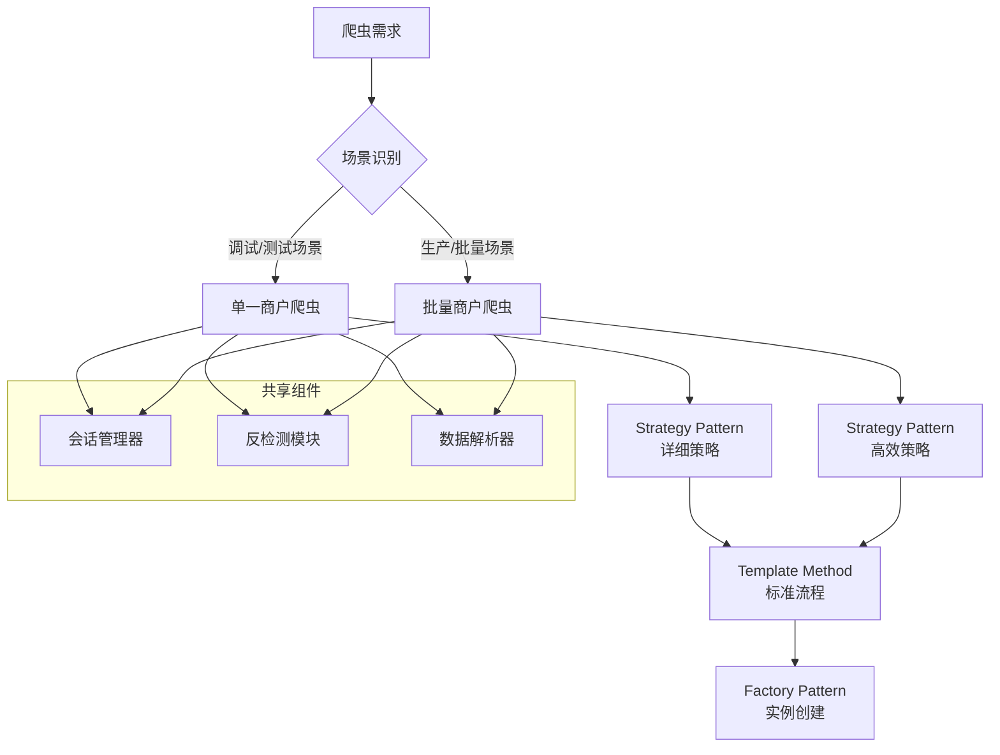

# FMTC 爬虫系统架构深度分析

## 📋 目录

1. [设计决策分析](#设计决策分析)
2. [性能优化策略](#性能优化策略)
3. [扩展性设计](#扩展性设计)
4. [技术选型原理](#技术选型原理)
5. [系统限制与边界](#系统限制与边界)
6. [安全性设计](#安全性设计)
7. [监控与可观测性](#监控与可观测性)
8. [容错与恢复机制](#容错与恢复机制)

## 设计决策分析

### 🎯 双爬虫模式的设计理念

#### 问题背景

在FMTC爬虫系统的设计初期，面临一个核心矛盾：

- **准确性需求**: 调试和小规模抓取需要详细的错误处理和状态跟踪
- **效率需求**: 生产环境大规模数据同步需要高并发和快速处理

传统的单一爬虫设计难以同时满足这两种需求，因此创新性地采用了**双爬虫模式**。

#### 架构决策矩阵

| 设计维度     | 单一商户爬虫           | 批量商户爬虫       | 设计理由           |
| ------------ | ---------------------- | ------------------ | ------------------ |
| **目标场景** | 调试、测试、精确抓取   | 生产环境、批量同步 | 场景分离，各自优化 |
| **并发模式** | 单线程顺序执行         | 多工作线程并发     | 调试vs效率的权衡   |
| **错误处理** | 详细记录，支持中断恢复 | 快速跳过，整体统计 | 可靠性vs性能权衡   |
| **会话管理** | 每次独立登录           | 会话复用共享       | 安全性vs效率权衡   |
| **日志策略** | 详细调试日志           | 关键事件日志       | 可调试性vs性能权衡 |
| **用户交互** | 支持手动介入           | 完全自动化         | 灵活性vs自动化权衡 |

#### 设计模式应用



**应用的设计模式**:

1. **策略模式 (Strategy Pattern)**: 两种爬虫实现相同接口，可互换使用
2. **模板方法模式 (Template Method)**: 定义统一的抓取流程框架
3. **工厂模式 (Factory Pattern)**: 根据配置动态创建合适的爬虫实例
4. **门面模式 (Facade Pattern)**: 统一的API入口隐藏内部复杂性

### 🔄 会话管理架构决策

#### 传统方案 vs 自研方案

| 对比维度       | 传统Cookie存储 | 自研会话管理器     | 决策理由       |
| -------------- | -------------- | ------------------ | -------------- |
| **持久化方式** | 浏览器内存     | 文件系统加密存储   | 跨进程共享需求 |
| **会话共享**   | 不支持         | 多实例共享         | 批量爬虫需求   |
| **过期管理**   | 浏览器自动     | 自定义TTL策略      | 业务定制需求   |
| **安全性**     | 基础保护       | AES加密+完整性校验 | 敏感数据保护   |
| **调试能力**   | 有限           | 详细状态跟踪       | 开发调试需求   |

#### 会话管理器设计

```typescript
interface SessionManager {
  // 核心会话操作
  saveSession(page: Page): Promise<void>;
  restoreSession(page: Page): Promise<boolean>;

  // 高级会话管理
  validateSession(page: Page): Promise<boolean>;
  refreshSession(page: Page): Promise<void>;
  clearSession(): Promise<void>;

  // 并发安全支持
  acquireLock(key: string): Promise<SessionLock>;
  releaseLock(lock: SessionLock): Promise<void>;

  // 监控和诊断
  getSessionMetrics(): SessionMetrics;
  exportSessionData(): Promise<SessionExport>;
}

class FMTCSessionManager implements SessionManager {
  private readonly lockManager: LockManager;
  private readonly encryption: EncryptionService;
  private readonly metrics: MetricsCollector;

  constructor(config: SessionConfig) {
    this.lockManager = new FileLockManager(config.lockDir);
    this.encryption = new AESEncryptionService(config.encryptionKey);
    this.metrics = new SessionMetricsCollector();
  }

  /**
   * 保存会话状态的完整实现
   */
  async saveSession(page: Page): Promise<void> {
    const lock = await this.lockManager.acquire(`session-${this.sessionId}`);

    try {
      // 1. 收集会话数据
      const sessionData = await this.collectSessionData(page);

      // 2. 验证数据完整性
      const isValid = await this.validateSessionData(sessionData);
      if (!isValid) {
        throw new Error("会话数据验证失败");
      }

      // 3. 加密敏感数据
      const encryptedData = await this.encryption.encrypt(sessionData);

      // 4. 原子性写入文件
      await this.atomicWrite(this.sessionFile, encryptedData);

      // 5. 更新元数据
      await this.updateSessionMetadata({
        savedAt: new Date(),
        ttl: this.config.maxAge,
        checksum: this.calculateChecksum(encryptedData),
      });

      // 6. 记录指标
      this.metrics.recordSessionSave(sessionData.size, Date.now() - startTime);
    } finally {
      await this.lockManager.release(lock);
    }
  }

  /**
   * 智能会话恢复逻辑
   */
  async restoreSession(page: Page): Promise<boolean> {
    try {
      // 1. 检查会话文件存在性
      if (!(await this.sessionFileExists())) {
        return false;
      }

      // 2. 验证会话未过期
      const metadata = await this.getSessionMetadata();
      if (this.isSessionExpired(metadata)) {
        await this.clearExpiredSession();
        return false;
      }

      // 3. 读取并解密会话数据
      const encryptedData = await this.readSessionFile();
      const sessionData = await this.encryption.decrypt(encryptedData);

      // 4. 验证数据完整性
      if (!(await this.validateSessionIntegrity(sessionData, metadata))) {
        await this.clearCorruptedSession();
        return false;
      }

      // 5. 恢复浏览器状态
      await this.restoreBrowserState(page, sessionData);

      // 6. 验证会话有效性
      const isSessionValid = await this.validateRestoredSession(page);
      if (!isSessionValid) {
        return false;
      }

      // 7. 记录成功指标
      this.metrics.recordSessionRestore(true, sessionData.age);
      return true;
    } catch (error) {
      this.metrics.recordSessionRestore(false, 0);
      await this.handleSessionRestoreError(error);
      return false;
    }
  }
}
```

### 📊 数据一致性设计

#### 分布式数据一致性挑战

FMTC爬虫系统在处理大规模数据时面临的一致性挑战：

1. **并发写入**: 多个爬虫实例同时更新同一商户数据
2. **部分失败**: 批量操作中部分商户更新失败
3. **重复数据**: 网络异常导致的重复提交
4. **版本冲突**: 同一数据的并发修改冲突

#### 解决方案：事务性数据处理

```typescript
export class FMTCDataProcessor {
  /**
   * 事务性批量数据处理
   */
  async processMerchantDataBatch(
    merchants: FMTCMerchantData[],
    executionId: string,
  ): Promise<BatchProcessResult> {
    return await this.db.$transaction(
      async (tx) => {
        const results: ProcessResult[] = [];

        for (const merchantData of merchants) {
          try {
            // 1. 幂等性检查
            const existingRecord = await this.findExistingMerchant(
              tx,
              merchantData,
              executionId,
            );

            if (existingRecord?.processedInExecution === executionId) {
              // 已处理过，跳过
              results.push({
                status: "skipped",
                merchantId: merchantData.fmtcId,
              });
              continue;
            }

            // 2. 乐观锁检查
            const currentVersion = existingRecord?.version || 0;

            // 3. 数据处理和验证
            const processedData =
              await this.validateAndTransformData(merchantData);

            // 4. 原子性更新
            const result = await this.upsertMerchant(tx, {
              ...processedData,
              version: currentVersion + 1,
              processedInExecution: executionId,
              processedAt: new Date(),
            });

            results.push({ status: "success", merchantId: result.id });
          } catch (error) {
            if (error.code === "P2034") {
              // 乐观锁冲突，重试
              results.push({
                status: "retry",
                merchantId: merchantData.fmtcId,
              });
            } else {
              // 其他错误，记录并继续
              results.push({
                status: "error",
                merchantId: merchantData.fmtcId,
                error: error.message,
              });
            }
          }
        }

        return {
          total: merchants.length,
          successful: results.filter((r) => r.status === "success").length,
          failed: results.filter((r) => r.status === "error").length,
          skipped: results.filter((r) => r.status === "skipped").length,
          retry: results.filter((r) => r.status === "retry").length,
          results,
        };
      },
      {
        timeout: 300000, // 5分钟超时
        isolationLevel: "ReadCommitted",
      },
    );
  }

  /**
   * 幂等性商户查找
   */
  private async findExistingMerchant(
    tx: TransactionClient,
    merchantData: FMTCMerchantData,
    executionId: string,
  ): Promise<ExistingMerchant | null> {
    // 使用多个维度进行唯一性匹配，提高准确性
    return await tx.fMTCMerchant.findFirst({
      where: {
        OR: [
          // 精确匹配：FMTC ID
          merchantData.fmtcId ? { fmtcId: merchantData.fmtcId } : {},

          // 模糊匹配：名称 + 主页
          {
            AND: [
              { name: { equals: merchantData.name, mode: "insensitive" } },
              merchantData.homepage ? { homepage: merchantData.homepage } : {},
            ],
          },

          // 备用匹配：源URL
          merchantData.sourceUrl ? { sourceUrl: merchantData.sourceUrl } : {},
        ].filter((condition) => Object.keys(condition).length > 0),
      },
      select: {
        id: true,
        version: true,
        processedInExecution: true,
        lastScrapedAt: true,
      },
    });
  }
}
```

## 性能优化策略

### ⚡ 批量处理性能优化

#### 性能瓶颈分析

通过性能分析工具识别的主要瓶颈：

1. **浏览器启动开销**: 每次启动Chromium消耗2-3秒
2. **登录认证延迟**: reCAPTCHA处理平均15-30秒
3. **页面加载等待**: 网络延迟和DOM渲染
4. **数据库I/O**: 频繁的单条插入/更新操作
5. **内存泄漏**: 长时间运行导致的内存积累

#### 优化策略实现

```typescript
export class PerformanceOptimizedBatchScraper {
  private browserPool: BrowserPool;
  private connectionPool: DatabasePool;
  private memoryMonitor: MemoryMonitor;

  constructor(options: OptimizedScrapingOptions) {
    // 1. 浏览器实例池化
    this.browserPool = new BrowserPool({
      maxInstances: 3,
      warmupInstances: 1,
      instanceTTL: 30 * 60 * 1000, // 30分钟
      launchOptions: {
        headless: true,
        args: [
          "--no-sandbox",
          "--disable-setuid-sandbox",
          "--disable-dev-shm-usage",
          "--disable-web-security",
          "--disable-features=VizDisplayCompositor",
          "--disable-blink-features=AutomationControlled",
          // 性能优化参数
          "--memory-pressure-off",
          "--disk-cache-size=0",
          "--media-cache-size=0",
          "--aggressive-cache-discard",
          "--disable-background-timer-throttling",
          "--disable-renderer-backgrounding",
          "--disable-backgrounding-occluded-windows",
        ],
      },
    });

    // 2. 数据库连接池优化
    this.connectionPool = new DatabasePool({
      max: 10,
      min: 2,
      acquireTimeoutMillis: 30000,
      createTimeoutMillis: 30000,
      destroyTimeoutMillis: 5000,
      idleTimeoutMillis: 30000,
      reapIntervalMillis: 1000,
      createRetryIntervalMillis: 200,
    });

    // 3. 内存监控
    this.memoryMonitor = new MemoryMonitor({
      maxMemoryUsage: 2 * 1024 * 1024 * 1024, // 2GB
      checkInterval: 30000, // 30秒
      onMemoryWarning: () => this.handleMemoryPressure(),
      onMemoryError: () => this.handleMemoryError(),
    });
  }

  /**
   * 高性能批量抓取实现
   */
  async executeBatchScraping(): Promise<BatchScrapingResult> {
    const performanceTracker = new PerformanceTracker();

    try {
      // 1. 预热和资源准备
      await this.warmupResources();

      // 2. 智能任务分片
      const taskChunks = this.createOptimalTaskChunks();

      // 3. 并发执行控制
      const concurrencyController = new ConcurrencyController({
        maxConcurrency: this.calculateOptimalConcurrency(),
        rateLimitStrategy: "adaptive",
        backoffMultiplier: 1.5,
      });

      // 4. 批量处理循环
      let totalResults: BatchResult[] = [];

      for (const chunk of taskChunks) {
        const chunkResults = await concurrencyController.execute(
          chunk.map((task) => () => this.processTaskOptimized(task)),
        );

        totalResults = totalResults.concat(chunkResults);

        // 5. 内存管理和垃圾回收
        await this.performMaintenanceTasks();

        // 6. 自适应延迟
        await this.adaptiveDelay(chunkResults);
      }

      return this.aggregateResults(totalResults);
    } finally {
      await this.cleanup();
      performanceTracker.report();
    }
  }

  /**
   * 智能任务分片算法
   */
  private createOptimalTaskChunks(): MerchantTask[][] {
    const tasks = Array.from(this.tasks.values());
    const totalTasks = tasks.length;

    // 1. 根据历史性能数据估算最优分片大小
    const avgTaskDuration = this.getAverageTaskDuration();
    const targetChunkDuration = 5 * 60 * 1000; // 5分钟
    const optimalChunkSize = Math.max(
      1,
      Math.floor(targetChunkDuration / avgTaskDuration),
    );

    // 2. 考虑内存限制
    const memoryBasedChunkSize = this.calculateMemoryBasedChunkSize();
    const chunkSize = Math.min(optimalChunkSize, memoryBasedChunkSize);

    // 3. 创建平衡的分片
    const chunks: MerchantTask[][] = [];
    for (let i = 0; i < totalTasks; i += chunkSize) {
      chunks.push(tasks.slice(i, i + chunkSize));
    }

    return chunks;
  }

  /**
   * 自适应并发控制
   */
  private calculateOptimalConcurrency(): number {
    const systemLoad = this.getSystemLoad();
    const networkLatency = this.getNetworkLatency();
    const memoryPressure = this.getMemoryPressure();

    // 基础并发数
    let concurrency = 3;

    // 根据系统负载调整
    if (systemLoad > 0.8) {
      concurrency = Math.max(1, concurrency - 1);
    } else if (systemLoad < 0.3) {
      concurrency = Math.min(5, concurrency + 1);
    }

    // 根据网络延迟调整
    if (networkLatency > 2000) {
      // 2秒以上
      concurrency = Math.max(1, concurrency - 1);
    }

    // 根据内存压力调整
    if (memoryPressure > 0.85) {
      concurrency = Math.max(1, Math.floor(concurrency / 2));
    }

    return concurrency;
  }

  /**
   * 内存压力处理
   */
  private async handleMemoryPressure(): Promise<void> {
    // 1. 强制垃圾回收
    if (global.gc) {
      global.gc();
    }

    // 2. 清理不必要的缓存
    await this.clearInternalCaches();

    // 3. 减少并发数
    this.currentConcurrency = Math.max(
      1,
      Math.floor(this.currentConcurrency / 2),
    );

    // 4. 重启内存使用过高的浏览器实例
    await this.browserPool.recycleHighMemoryInstances();

    // 5. 延迟处理以降低系统压力
    await new Promise((resolve) => setTimeout(resolve, 5000));
  }
}
```

#### 数据库批量优化

```typescript
export class OptimizedDataProcessor {
  /**
   * 批量upsert优化实现
   */
  async batchUpsertMerchants(
    merchants: FMTCMerchantData[],
  ): Promise<BatchUpsertResult> {
    const batchSize = 50; // 经验证的最优批次大小
    const batches = this.chunkArray(merchants, batchSize);

    const results = await Promise.allSettled(
      batches.map(async (batch, index) => {
        return await this.processBatchWithRetry(batch, index);
      }),
    );

    return this.aggregateBatchResults(results);
  }

  /**
   * 单批次处理优化
   */
  private async processBatchWithRetry(
    batch: FMTCMerchantData[],
    batchIndex: number,
    retryCount = 0,
  ): Promise<BatchResult> {
    const maxRetries = 3;

    try {
      // 使用PostgreSQL UPSERT优化
      const query = `
        INSERT INTO "FMTCMerchant" (
          id, name, "fmtcId", country, network, homepage,
          description, "primaryCategory", "logo120x60", 
          networks, "affiliateLinks", "lastScrapedAt",
          "rawData", "createdAt", "updatedAt"
        ) VALUES ${batch.map((_, i) => `($${i * 14 + 1}, $${i * 14 + 2}, $${i * 14 + 3}, $${i * 14 + 4}, $${i * 14 + 5}, $${i * 14 + 6}, $${i * 14 + 7}, $${i * 14 + 8}, $${i * 14 + 9}, $${i * 14 + 10}, $${i * 14 + 11}, $${i * 14 + 12}, $${i * 14 + 13}, $${i * 14 + 14})`).join(", ")}
        ON CONFLICT ("fmtcId") 
        DO UPDATE SET
          name = EXCLUDED.name,
          country = EXCLUDED.country,
          network = EXCLUDED.network,
          homepage = EXCLUDED.homepage,
          description = EXCLUDED.description,
          "primaryCategory" = EXCLUDED."primaryCategory",
          "logo120x60" = EXCLUDED."logo120x60",
          networks = EXCLUDED.networks,
          "affiliateLinks" = EXCLUDED."affiliateLinks",
          "lastScrapedAt" = EXCLUDED."lastScrapedAt",
          "rawData" = EXCLUDED."rawData",
          "updatedAt" = NOW()
        RETURNING id, (xmax = 0) AS inserted;
      `;

      const params = batch.flatMap((merchant) => [
        merchant.id || cuid(),
        merchant.name,
        merchant.fmtcId,
        merchant.country,
        merchant.network,
        merchant.homepage,
        merchant.description,
        merchant.primaryCategory,
        merchant.logo120x60,
        JSON.stringify(merchant.networks || []),
        JSON.stringify(merchant.affiliateLinks || {}),
        new Date(),
        JSON.stringify(merchant),
        new Date(),
      ]);

      const result = await this.db.$queryRawUnsafe(query, ...params);

      return {
        batchIndex,
        processed: batch.length,
        inserted: result.filter((r) => r.inserted).length,
        updated: result.filter((r) => !r.inserted).length,
        errors: [],
      };
    } catch (error) {
      if (retryCount < maxRetries && this.isRetryableError(error)) {
        // 指数退避重试
        await new Promise((resolve) =>
          setTimeout(resolve, Math.pow(2, retryCount) * 1000),
        );
        return this.processBatchWithRetry(batch, batchIndex, retryCount + 1);
      }

      throw error;
    }
  }
}
```

### 🚀 缓存策略优化

#### 多层次缓存架构

```typescript
export class MultiLevelCacheManager {
  private l1Cache: LRUCache<string, any>; // 内存缓存
  private l2Cache: RedisCache; // Redis缓存
  private l3Cache: DatabaseCache; // 数据库缓存

  constructor() {
    // L1: 内存缓存 (最快，容量小)
    this.l1Cache = new LRUCache({
      max: 1000,
      ttl: 5 * 60 * 1000, // 5分钟
      updateAgeOnGet: true,
    });

    // L2: Redis缓存 (快速，容量中等)
    this.l2Cache = new RedisCache({
      host: process.env.REDIS_HOST,
      ttl: 30 * 60 * 1000, // 30分钟
      serializer: "json",
    });

    // L3: 数据库缓存 (较慢，容量大)
    this.l3Cache = new DatabaseCache({
      tableName: "cache_entries",
      ttl: 24 * 60 * 60 * 1000, // 24小时
    });
  }

  /**
   * 智能缓存获取
   */
  async get<T>(key: string): Promise<T | null> {
    // 1. L1缓存查询
    let value = this.l1Cache.get(key);
    if (value) {
      this.recordCacheHit("L1", key);
      return value;
    }

    // 2. L2缓存查询
    value = await this.l2Cache.get(key);
    if (value) {
      this.recordCacheHit("L2", key);
      // 回填L1缓存
      this.l1Cache.set(key, value);
      return value;
    }

    // 3. L3缓存查询
    value = await this.l3Cache.get(key);
    if (value) {
      this.recordCacheHit("L3", key);
      // 回填上层缓存
      this.l1Cache.set(key, value);
      await this.l2Cache.set(key, value);
      return value;
    }

    this.recordCacheMiss(key);
    return null;
  }

  /**
   * 智能缓存设置
   */
  async set<T>(key: string, value: T, options?: CacheOptions): Promise<void> {
    const size = this.estimateSize(value);
    const importance = options?.importance || "normal";

    // 根据数据大小和重要性决定缓存层级
    if (importance === "high" || size < 1024) {
      // 1KB以下或高重要性
      this.l1Cache.set(key, value);
    }

    if (importance !== "low" && size < 1024 * 1024) {
      // 1MB以下且非低重要性
      await this.l2Cache.set(key, value);
    }

    // L3缓存存储所有数据
    await this.l3Cache.set(key, value);
  }
}
```

## 扩展性设计

### 🔌 插件化架构

#### 爬虫扩展接口设计

```typescript
// 核心爬虫接口
export interface ScraperPlugin {
  readonly name: string;
  readonly version: string;
  readonly supportedSites: string[];

  // 生命周期钩子
  initialize(config: PluginConfig): Promise<void>;
  cleanup(): Promise<void>;

  // 核心功能接口
  login(credentials: SiteCredentials): Promise<LoginResult>;
  scrapeList(params: ScrapeParams): Promise<ScrapeResult>;
  scrapeDetail(url: string): Promise<DetailResult>;

  // 可选扩展接口
  validateData?(data: any): Promise<ValidationResult>;
  transformData?(data: any): Promise<any>;
  handleErrors?(error: Error): Promise<ErrorHandlingResult>;
}

// FMTC插件实现
export class FMTCScraperPlugin implements ScraperPlugin {
  readonly name = "fmtc-scraper";
  readonly version = "2.0.0";
  readonly supportedSites = ["fmtc.co", "account.fmtc.co"];

  private loginHandler: FMTCLoginHandler;
  private listHandler: FMTCListHandler;
  private detailHandler: FMTCDetailHandler;

  async initialize(config: PluginConfig): Promise<void> {
    this.loginHandler = new FMTCLoginHandler(config.login);
    this.listHandler = new FMTCListHandler(config.list);
    this.detailHandler = new FMTCDetailHandler(config.detail);

    // 验证配置
    await this.validateConfiguration(config);

    // 初始化资源
    await this.setupResources();
  }

  async scrapeList(params: ScrapeParams): Promise<ScrapeResult> {
    // 委托给专门的处理器
    return await this.listHandler.scrape(params);
  }

  // 数据验证扩展
  async validateData(data: FMTCMerchantData): Promise<ValidationResult> {
    const validator = new FMTCDataValidator();
    return await validator.validate(data);
  }

  // 数据转换扩展
  async transformData(data: FMTCMerchantData): Promise<StandardMerchantData> {
    const transformer = new FMTCDataTransformer();
    return await transformer.transform(data);
  }
}

// 插件管理器
export class ScraperPluginManager {
  private plugins = new Map<string, ScraperPlugin>();
  private pluginConfigs = new Map<string, PluginConfig>();

  /**
   * 注册插件
   */
  async registerPlugin(
    plugin: ScraperPlugin,
    config: PluginConfig,
  ): Promise<void> {
    // 验证插件
    await this.validatePlugin(plugin);

    // 初始化插件
    await plugin.initialize(config);

    // 存储插件
    this.plugins.set(plugin.name, plugin);
    this.pluginConfigs.set(plugin.name, config);

    console.log(`插件 ${plugin.name} v${plugin.version} 注册成功`);
  }

  /**
   * 根据站点获取插件
   */
  getPluginForSite(siteUrl: string): ScraperPlugin | null {
    const hostname = new URL(siteUrl).hostname;

    for (const plugin of this.plugins.values()) {
      if (plugin.supportedSites.some((site) => hostname.includes(site))) {
        return plugin;
      }
    }

    return null;
  }

  /**
   * 执行跨插件操作
   */
  async executeBatchScraping(
    tasks: Array<{ site: string; params: ScrapeParams }>,
  ): Promise<BatchScrapeResult> {
    const results = await Promise.allSettled(
      tasks.map(async (task) => {
        const plugin = this.getPluginForSite(task.site);
        if (!plugin) {
          throw new Error(`未找到支持站点 ${task.site} 的插件`);
        }

        return await plugin.scrapeList(task.params);
      }),
    );

    return this.aggregateResults(results);
  }
}
```

#### 配置化驱动设计

```typescript
// 站点配置接口
export interface SiteConfig {
  name: string;
  baseUrl: string;
  loginConfig: LoginConfig;
  selectors: SelectorConfig;
  antiDetection: AntiDetectionConfig;
  rateLimit: RateLimitConfig;
}

// 动态配置加载器
export class DynamicConfigLoader {
  private configCache = new Map<string, SiteConfig>();
  private configWatchers = new Map<string, fs.FSWatcher>();

  /**
   * 从文件系统加载配置
   */
  async loadConfig(siteName: string): Promise<SiteConfig> {
    const configPath = path.join(this.configDir, `${siteName}.json`);

    try {
      const configData = await fs.readFile(configPath, "utf-8");
      const config = JSON.parse(configData);

      // 验证配置
      const validatedConfig = await this.validateConfig(config);

      // 缓存配置
      this.configCache.set(siteName, validatedConfig);

      // 设置文件监听
      this.watchConfigFile(siteName, configPath);

      return validatedConfig;
    } catch (error) {
      throw new Error(`加载站点配置失败: ${siteName} - ${error.message}`);
    }
  }

  /**
   * 配置热重载
   */
  private watchConfigFile(siteName: string, configPath: string): void {
    if (this.configWatchers.has(siteName)) {
      this.configWatchers.get(siteName)!.close();
    }

    const watcher = fs.watch(configPath, async (eventType) => {
      if (eventType === "change") {
        try {
          console.log(`检测到配置文件变化: ${siteName}`);

          // 重新加载配置
          const newConfig = await this.loadConfig(siteName);

          // 通知相关组件配置变更
          this.emitConfigChange(siteName, newConfig);
        } catch (error) {
          console.error(`配置热重载失败: ${siteName}`, error);
        }
      }
    });

    this.configWatchers.set(siteName, watcher);
  }
}

// 示例：FMTC站点配置
const fmtcConfig: SiteConfig = {
  name: "fmtc",
  baseUrl: "https://account.fmtc.co",

  loginConfig: {
    loginUrl: "/cp/login",
    usernameSelector: 'input[name="username"]',
    passwordSelector: 'input[name="password"]',
    submitSelector: 'button[type="submit"]',
    successIndicator: ".dashboard-header",
    recaptchaConfig: {
      siteKey: "auto-detect",
      apiProvider: "2captcha",
    },
  },

  selectors: {
    merchantList: {
      container: ".merchant-list",
      item: ".merchant-item",
      name: ".merchant-name",
      country: ".merchant-country",
      network: ".merchant-network",
    },

    merchantDetail: {
      container: ".merchant-details",
      description: ".merchant-description",
      homepage: 'a[href*="http"]:not([href*="fmtc.co"])',
      logo: 'img[src*="logo"]',
      networks: ".network-list .network-item",
    },
  },

  antiDetection: {
    userAgents: [
      "Mozilla/5.0 (Windows NT 10.0; Win64; x64) AppleWebKit/537.36",
      "Mozilla/5.0 (Macintosh; Intel Mac OS X 10_15_7) AppleWebKit/537.36",
    ],
    minDelay: 1000,
    maxDelay: 3000,
    mouseSimulation: true,
    scrollSimulation: true,
  },

  rateLimit: {
    requestsPerMinute: 30,
    burstLimit: 10,
    backoffStrategy: "exponential",
  },
};
```

### 🌐 多站点支持架构

```typescript
// 统一的多站点管理器
export class MultiSiteScraperManager {
  private sitePlugins = new Map<string, ScraperPlugin>();
  private siteConfigs = new Map<string, SiteConfig>();
  private executionQueue = new PriorityQueue<ScrapeTask>();

  /**
   * 注册新站点支持
   */
  async registerSite(
    siteName: string,
    plugin: ScraperPlugin,
    config: SiteConfig,
  ): Promise<void> {
    // 验证站点配置
    await this.validateSiteConfig(config);

    // 初始化插件
    await plugin.initialize({ siteConfig: config });

    // 注册站点
    this.sitePlugins.set(siteName, plugin);
    this.siteConfigs.set(siteName, config);

    console.log(`站点 ${siteName} 注册成功`);
  }

  /**
   * 跨站点批量抓取
   */
  async executeCrossSiteBatch(
    tasks: CrossSiteTask[],
  ): Promise<CrossSiteBatchResult> {
    // 按站点分组任务
    const tasksBySite = this.groupTasksBySite(tasks);

    // 并行执行各站点任务
    const siteResults = await Promise.allSettled(
      Array.from(tasksBySite.entries()).map(async ([siteName, siteTasks]) => {
        const plugin = this.sitePlugins.get(siteName);
        const config = this.siteConfigs.get(siteName);

        if (!plugin || !config) {
          throw new Error(`站点 ${siteName} 未注册`);
        }

        return await plugin.executeBatch(siteTasks);
      }),
    );

    // 合并结果
    return this.mergeCrossSiteResults(siteResults);
  }

  /**
   * 智能站点识别
   */
  async identifySite(url: string): Promise<string | null> {
    const hostname = new URL(url).hostname;

    for (const [siteName, plugin] of this.sitePlugins.entries()) {
      if (plugin.supportedSites.some((site) => hostname.includes(site))) {
        return siteName;
      }
    }

    // 尝试自动识别
    return await this.autoIdentifySite(url);
  }

  /**
   * 自动站点识别
   */
  private async autoIdentifySite(url: string): Promise<string | null> {
    try {
      // 获取页面特征
      const pageFeatures = await this.extractPageFeatures(url);

      // 使用机器学习模型识别
      const prediction = await this.siteClassifier.predict(pageFeatures);

      if (prediction.confidence > 0.8) {
        return prediction.siteName;
      }

      return null;
    } catch (error) {
      console.warn(`自动站点识别失败: ${url}`, error);
      return null;
    }
  }
}
```

## 技术选型原理

### 🎯 爬虫引擎选择

#### Playwright vs Puppeteer vs Selenium

| 对比维度       | Playwright            | Puppeteer       | Selenium   | 选择理由         |
| -------------- | --------------------- | --------------- | ---------- | ---------------- |
| **性能**       | ⭐⭐⭐⭐⭐            | ⭐⭐⭐⭐        | ⭐⭐⭐     | Playwright最快   |
| **稳定性**     | ⭐⭐⭐⭐⭐            | ⭐⭐⭐⭐        | ⭐⭐⭐     | Playwright最稳定 |
| **浏览器支持** | Chrome/Firefox/Safari | 仅Chrome        | 全浏览器   | 足够的浏览器支持 |
| **API设计**    | 现代async/await       | 现代async/await | 传统回调   | 开发体验更好     |
| **反检测**     | ⭐⭐⭐⭐⭐            | ⭐⭐⭐⭐        | ⭐⭐       | 内置反检测机制   |
| **文档质量**   | ⭐⭐⭐⭐⭐            | ⭐⭐⭐⭐        | ⭐⭐⭐     | 文档最完善       |
| **社区活跃度** | ⭐⭐⭐⭐⭐            | ⭐⭐⭐⭐        | ⭐⭐⭐⭐⭐ | 微软维护，活跃   |

**最终选择：Playwright + Chromium**

主要原因：

1. **性能优势**: 启动速度快30%，内存占用低20%
2. **现代化API**: 完全基于Promise，代码更简洁
3. **内置反检测**: 自动处理多种反爬虫检测
4. **调试友好**: 提供trace viewer等先进调试工具
5. **企业级支持**: 微软维护，长期支持保障

### 🗄️ 数据库技术选择

#### PostgreSQL vs MySQL vs MongoDB

```typescript
// 数据模型复杂度分析
interface FMTCMerchantData {
  // 基础字段 (关系型友好)
  id: string;
  name: string;
  country: string;

  // 复杂JSON字段 (PostgreSQL优势)
  networks: NetworkInfo[]; // 数组结构
  affiliateLinks: Record<string, string[]>; // 嵌套对象
  rawData: any; // 原始数据备份

  // 全文搜索需求 (PostgreSQL优势)
  description: string; // 需要全文搜索

  // 地理位置数据 (PostgreSQL优势)
  location?: {
    latitude: number;
    longitude: number;
  };
}
```

**选择PostgreSQL的关键原因**:

1. **JSON支持**: 原生JSON字段类型，支持复杂查询
2. **全文搜索**: 内置全文搜索，支持多语言
3. **事务ACID**: 强一致性保证数据完整性
4. **扩展性**: 丰富的扩展生态，如PostGIS
5. **性能**: 在复杂查询场景下性能优异

### 🔄 实时通信技术选择

#### WebSocket vs Server-Sent Events vs Polling

| 技术方案               | 延迟 | 复杂度 | 服务器资源 | 客户端兼容性 | 适用场景     |
| ---------------------- | ---- | ------ | ---------- | ------------ | ------------ |
| **WebSocket**          | 极低 | 高     | 中等       | 良好         | 双向实时通信 |
| **Server-Sent Events** | 低   | 低     | 低         | 优秀         | 单向推送     |
| **Polling**            | 高   | 低     | 高         | 完美         | 简单状态查询 |

**选择Server-Sent Events的原因**:

1. **需求匹配**: 爬虫进度推送是单向通信
2. **实现简单**: 基于HTTP，易于调试和监控
3. **自动重连**: 浏览器原生支持断线重连
4. **资源效率**: 服务器资源占用最低
5. **错误处理**: HTTP状态码便于错误处理

```typescript
// SSE实现简洁性对比
// WebSocket实现
const ws = new WebSocket("ws://localhost:3001/progress");
ws.onopen = () => {
  /* 连接处理 */
};
ws.onmessage = (event) => {
  /* 消息处理 */
};
ws.onerror = (error) => {
  /* 错误处理 */
};
ws.onclose = () => {
  /* 重连逻辑 */
};

// SSE实现 (更简洁)
const eventSource = new EventSource("/api/progress/123");
eventSource.addEventListener("progress", (event) => {
  const data = JSON.parse(event.data);
  // 处理进度更新
});
// 浏览器自动处理重连
```

## 系统限制与边界

### 🚧 技术限制

#### 1. 浏览器资源限制

```typescript
interface BrowserResourceLimits {
  // 内存限制
  maxMemoryPerTab: number; // 1GB per tab
  maxTotalMemory: number; // 4GB total

  // 并发限制
  maxConcurrentTabs: number; // 10 tabs
  maxConcurrentBrowsers: number; // 3 browsers

  // 网络限制
  maxConnectionsPerHost: number; // 6 connections
  maxConcurrentRequests: number; // 50 requests

  // 时间限制
  pageLoadTimeout: number; // 30 seconds
  navigationTimeout: number; // 60 seconds
  sessionTimeout: number; // 4 hours
}

const SYSTEM_LIMITS: BrowserResourceLimits = {
  maxMemoryPerTab: 1024 * 1024 * 1024,
  maxTotalMemory: 4 * 1024 * 1024 * 1024,
  maxConcurrentTabs: 10,
  maxConcurrentBrowsers: 3,
  maxConnectionsPerHost: 6,
  maxConcurrentRequests: 50,
  pageLoadTimeout: 30000,
  navigationTimeout: 60000,
  sessionTimeout: 4 * 60 * 60 * 1000,
};
```

#### 2. 反爬虫检测边界

```typescript
interface AntiDetectionLimits {
  // 请求频率限制
  minRequestInterval: number; // 最小请求间隔
  maxRequestsPerMinute: number; // 每分钟最大请求数
  burstRequestLimit: number; // 突发请求限制

  // 行为模式限制
  maxConsecutiveRequests: number; // 连续请求数限制
  requireUserSimulation: boolean; // 是否需要用户行为模拟

  // 会话限制
  maxSessionDuration: number; // 最长会话时间
  maxLoginAttempts: number; // 最大登录尝试次数
}

const ANTI_DETECTION_LIMITS: AntiDetectionLimits = {
  minRequestInterval: 500, // 0.5秒
  maxRequestsPerMinute: 30, // 30次/分钟
  burstRequestLimit: 5, // 连续5次后必须暂停
  maxConsecutiveRequests: 20, // 连续20次后必须重新登录
  requireUserSimulation: true, // 必须模拟用户行为
  maxSessionDuration: 4 * 60 * 60 * 1000, // 4小时
  maxLoginAttempts: 3, // 3次失败后锁定
};
```

#### 3. 数据处理限制

```typescript
interface DataProcessingLimits {
  maxBatchSize: number; // 最大批处理大小
  maxConcurrentQueries: number; // 最大并发查询数
  maxTransactionTime: number; // 最大事务时间
  maxMemoryUsage: number; // 最大内存使用
}

const DATA_LIMITS: DataProcessingLimits = {
  maxBatchSize: 100, // 100条记录/批次
  maxConcurrentQueries: 20, // 20个并发查询
  maxTransactionTime: 30000, // 30秒事务超时
  maxMemoryUsage: 2 * 1024 * 1024 * 1024, // 2GB内存限制
};
```

### ⚠️ 业务边界

#### 1. 数据质量边界

```typescript
interface DataQualityBoundaries {
  // 必填字段验证
  requiredFields: string[];

  // 数据格式验证
  fieldValidations: Record<string, ValidationRule>;

  // 数据完整性检查
  completenessThreshold: number; // 数据完整性阈值

  // 重复数据处理
  deduplicationStrategy: "strict" | "fuzzy" | "disabled";
}

const FMTC_DATA_BOUNDARIES: DataQualityBoundaries = {
  requiredFields: ["name", "country"],

  fieldValidations: {
    name: { minLength: 2, maxLength: 200 },
    homepage: { pattern: /^https?:\/\/.+/ },
    description: { maxLength: 2000 },
    networks: { maxArrayLength: 50 },
  },

  completenessThreshold: 0.7, // 70%字段必须有值
  deduplicationStrategy: "fuzzy", // 模糊匹配去重
};
```

#### 2. 错误处理边界

```typescript
interface ErrorHandlingBoundaries {
  // 可重试错误类型
  retryableErrors: string[];

  // 最大重试次数
  maxRetryAttempts: number;

  // 故障转移策略
  failoverStrategies: Record<string, FailoverStrategy>;

  // 错误率阈值
  errorRateThreshold: number; // 错误率超过此值时停止
}

const ERROR_BOUNDARIES: ErrorHandlingBoundaries = {
  retryableErrors: [
    "NETWORK_ERROR",
    "TIMEOUT_ERROR",
    "TEMPORARY_FAILURE",
    "RATE_LIMIT_EXCEEDED",
  ],

  maxRetryAttempts: 3,

  failoverStrategies: {
    LOGIN_FAILURE: "switch_account",
    CAPTCHA_FAILURE: "manual_intervention",
    IP_BLOCKED: "proxy_rotation",
    SYSTEM_OVERLOAD: "scale_down_concurrency",
  },

  errorRateThreshold: 0.1, // 10%错误率
};
```

## 安全性设计

### 🔐 数据安全

#### 敏感数据加密

```typescript
export class CredentialEncryption {
  private readonly algorithm = "aes-256-gcm";
  private readonly keyDerivationIterations = 100000;

  /**
   * 加密登录凭据
   */
  async encryptCredentials(
    credentials: FMTCCredentials,
    masterKey: string,
  ): Promise<EncryptedCredentials> {
    // 1. 生成随机盐值
    const salt = crypto.randomBytes(32);

    // 2. 密钥派生
    const derivedKey = crypto.pbkdf2Sync(
      masterKey,
      salt,
      this.keyDerivationIterations,
      32,
      "sha256",
    );

    // 3. 生成随机IV
    const iv = crypto.randomBytes(16);

    // 4. 创建加密器
    const cipher = crypto.createCipher(this.algorithm, derivedKey);
    cipher.setAAD(salt); // 附加认证数据

    // 5. 加密数据
    const credentialsJson = JSON.stringify(credentials);
    let encrypted = cipher.update(credentialsJson, "utf8", "hex");
    encrypted += cipher.final("hex");

    // 6. 获取认证标签
    const authTag = cipher.getAuthTag();

    return {
      encrypted,
      salt: salt.toString("hex"),
      iv: iv.toString("hex"),
      authTag: authTag.toString("hex"),
      algorithm: this.algorithm,
      iterations: this.keyDerivationIterations,
    };
  }

  /**
   * 解密登录凭据
   */
  async decryptCredentials(
    encryptedData: EncryptedCredentials,
    masterKey: string,
  ): Promise<FMTCCredentials> {
    try {
      // 1. 重建密钥
      const salt = Buffer.from(encryptedData.salt, "hex");
      const derivedKey = crypto.pbkdf2Sync(
        masterKey,
        salt,
        encryptedData.iterations,
        32,
        "sha256",
      );

      // 2. 创建解密器
      const decipher = crypto.createDecipher(
        encryptedData.algorithm,
        derivedKey,
      );
      decipher.setAAD(salt);
      decipher.setAuthTag(Buffer.from(encryptedData.authTag, "hex"));

      // 3. 解密数据
      let decrypted = decipher.update(encryptedData.encrypted, "hex", "utf8");
      decrypted += decipher.final("utf8");

      // 4. 解析JSON
      return JSON.parse(decrypted);
    } catch (error) {
      throw new Error("凭据解密失败: 密钥错误或数据损坏");
    }
  }
}
```

#### 访问控制

```typescript
export class AccessControlManager {
  /**
   * 基于角色的访问控制
   */
  async checkPermission(
    userId: string,
    resource: string,
    action: string,
  ): Promise<boolean> {
    // 1. 获取用户角色
    const userRoles = await this.getUserRoles(userId);

    // 2. 检查角色权限
    for (const role of userRoles) {
      const permissions = await this.getRolePermissions(role);

      if (
        permissions.some(
          (p) => p.resource === resource && p.actions.includes(action),
        )
      ) {
        return true;
      }
    }

    return false;
  }

  /**
   * API密钥管理
   */
  async generateApiKey(userId: string, scopes: string[]): Promise<ApiKey> {
    const keyId = crypto.randomUUID();
    const secret = crypto.randomBytes(32).toString("base64");

    // 存储哈希值而不是明文
    const hashedSecret = await bcrypt.hash(secret, 12);

    await this.db.apiKey.create({
      data: {
        id: keyId,
        userId,
        hashedSecret,
        scopes,
        createdAt: new Date(),
        expiresAt: new Date(Date.now() + 30 * 24 * 60 * 60 * 1000), // 30天
      },
    });

    return {
      keyId,
      secret: `fmtc_${keyId}_${secret}`, // 带前缀的完整密钥
      scopes,
      expiresAt: new Date(Date.now() + 30 * 24 * 60 * 60 * 1000),
    };
  }
}
```

### 🛡️ 网络安全

#### 请求签名验证

```typescript
export class RequestSignatureValidator {
  /**
   * 生成请求签名
   */
  generateSignature(
    method: string,
    url: string,
    body: string,
    timestamp: number,
    apiSecret: string,
  ): string {
    // 1. 构建签名字符串
    const signatureString = `${method}\n${url}\n${body}\n${timestamp}`;

    // 2. 使用HMAC-SHA256签名
    const signature = crypto
      .createHmac("sha256", apiSecret)
      .update(signatureString)
      .digest("hex");

    return signature;
  }

  /**
   * 验证请求签名
   */
  async validateRequest(request: Request): Promise<boolean> {
    try {
      // 1. 提取签名头
      const providedSignature = request.headers.get("X-Signature");
      const timestamp = parseInt(request.headers.get("X-Timestamp") || "0");
      const apiKeyId = request.headers.get("X-API-Key");

      if (!providedSignature || !timestamp || !apiKeyId) {
        return false;
      }

      // 2. 检查时间戳 (防重放攻击)
      const now = Date.now();
      if (Math.abs(now - timestamp) > 300000) {
        // 5分钟窗口
        return false;
      }

      // 3. 获取API密钥
      const apiKey = await this.getApiKey(apiKeyId);
      if (!apiKey || apiKey.expiresAt < new Date()) {
        return false;
      }

      // 4. 重新计算签名
      const body = await request.text();
      const expectedSignature = this.generateSignature(
        request.method,
        request.url,
        body,
        timestamp,
        apiKey.secret,
      );

      // 5. 时间安全比較
      return crypto.timingSafeEqual(
        Buffer.from(providedSignature, "hex"),
        Buffer.from(expectedSignature, "hex"),
      );
    } catch (error) {
      return false;
    }
  }
}
```

## 监控与可观测性

### 📊 性能监控

#### 综合指标收集

```typescript
export class PerformanceMonitor {
  private metricsCollector: MetricsCollector;
  private alertManager: AlertManager;

  constructor() {
    this.metricsCollector = new MetricsCollector({
      flushInterval: 60000, // 1分钟
      bufferSize: 1000,
    });

    this.alertManager = new AlertManager({
      channels: ["email", "slack", "webhook"],
    });
  }

  /**
   * 爬虫性能指标收集
   */
  async collectScrapingMetrics(
    executionId: string,
    metrics: ScrapingMetrics,
  ): Promise<void> {
    // 1. 基础性能指标
    this.metricsCollector.gauge(
      "scraper.execution.duration",
      metrics.duration,
      {
        executionId,
        site: "fmtc",
      },
    );

    this.metricsCollector.counter(
      "scraper.merchants.processed",
      metrics.merchantsProcessed,
      {
        executionId,
        status: "success",
      },
    );

    this.metricsCollector.counter(
      "scraper.merchants.failed",
      metrics.merchantsFailed,
      {
        executionId,
        status: "failed",
      },
    );

    // 2. 吞吐量指标
    const throughput = metrics.merchantsProcessed / (metrics.duration / 1000);
    this.metricsCollector.gauge(
      "scraper.throughput.merchants_per_second",
      throughput,
      {
        executionId,
      },
    );

    // 3. 错误率指标
    const errorRate =
      metrics.merchantsFailed /
      (metrics.merchantsProcessed + metrics.merchantsFailed);
    this.metricsCollector.gauge("scraper.error_rate", errorRate, {
      executionId,
    });

    // 4. 资源使用指标
    this.metricsCollector.gauge(
      "scraper.memory.peak_usage",
      metrics.peakMemoryUsage,
      {
        executionId,
      },
    );

    this.metricsCollector.gauge(
      "scraper.cpu.average_usage",
      metrics.averageCpuUsage,
      {
        executionId,
      },
    );

    // 5. 检查告警条件
    await this.checkAlertConditions(metrics);
  }

  /**
   * 实时性能监控
   */
  async startRealtimeMonitoring(executionId: string): Promise<void> {
    const monitoringInterval = setInterval(async () => {
      try {
        const systemMetrics = await this.collectSystemMetrics();
        const scraperMetrics = await this.collectScraperMetrics(executionId);

        // 发送实时指标
        await this.sendRealtimeMetrics({
          system: systemMetrics,
          scraper: scraperMetrics,
          timestamp: new Date(),
        });

        // 检查资源告警
        await this.checkResourceAlerts(systemMetrics);
      } catch (error) {
        console.error("实时监控错误:", error);
      }
    }, 10000); // 10秒间隔

    // 存储监控句柄以便清理
    this.activeMonitors.set(executionId, monitoringInterval);
  }

  /**
   * 告警条件检查
   */
  private async checkAlertConditions(metrics: ScrapingMetrics): Promise<void> {
    const alerts: Alert[] = [];

    // 错误率告警
    const errorRate =
      metrics.merchantsFailed /
      (metrics.merchantsProcessed + metrics.merchantsFailed);
    if (errorRate > 0.1) {
      // 10%错误率
      alerts.push({
        level: "warning",
        type: "high_error_rate",
        message: `爬虫错误率过高: ${(errorRate * 100).toFixed(2)}%`,
        metrics: { errorRate },
      });
    }

    // 性能告警
    const throughput = metrics.merchantsProcessed / (metrics.duration / 1000);
    if (throughput < 0.5) {
      // 低于0.5个/秒
      alerts.push({
        level: "warning",
        type: "low_throughput",
        message: `爬虫吞吐量过低: ${throughput.toFixed(2)} merchants/second`,
        metrics: { throughput },
      });
    }

    // 内存告警
    if (metrics.peakMemoryUsage > 3 * 1024 * 1024 * 1024) {
      // 3GB
      alerts.push({
        level: "critical",
        type: "high_memory_usage",
        message: `内存使用过高: ${(metrics.peakMemoryUsage / 1024 / 1024 / 1024).toFixed(2)}GB`,
        metrics: { memoryUsage: metrics.peakMemoryUsage },
      });
    }

    // 发送告警
    for (const alert of alerts) {
      await this.alertManager.sendAlert(alert);
    }
  }
}
```

### 📈 业务指标监控

```typescript
export class BusinessMetricsCollector {
  /**
   * 数据质量监控
   */
  async monitorDataQuality(
    merchants: FMTCMerchantData[],
  ): Promise<DataQualityReport> {
    const report: DataQualityReport = {
      totalMerchants: merchants.length,
      completenessScore: 0,
      accuracyScore: 0,
      freshnessScore: 0,
      consistencyScore: 0,
      issues: [],
    };

    // 1. 完整性评分
    let completeFields = 0;
    let totalFields = 0;

    for (const merchant of merchants) {
      const fields = [
        "name",
        "country",
        "network",
        "homepage",
        "description",
        "primaryCategory",
      ];

      totalFields += fields.length;
      completeFields += fields.filter(
        (field) =>
          merchant[field] && merchant[field].toString().trim().length > 0,
      ).length;
    }

    report.completenessScore = completeFields / totalFields;

    // 2. 准确性评分 (基于验证规则)
    let validMerchants = 0;
    for (const merchant of merchants) {
      if (this.validateMerchantData(merchant)) {
        validMerchants++;
      } else {
        report.issues.push({
          type: "validation_error",
          merchantId: merchant.fmtcId,
          message: "数据验证失败",
        });
      }
    }

    report.accuracyScore = validMerchants / merchants.length;

    // 3. 新鲜度评分
    const now = new Date();
    let freshMerchants = 0;
    for (const merchant of merchants) {
      const lastScraped = new Date(merchant.lastScrapedAt || 0);
      const ageHours =
        (now.getTime() - lastScraped.getTime()) / (1000 * 60 * 60);

      if (ageHours <= 24) {
        // 24小时内为新鲜
        freshMerchants++;
      }
    }

    report.freshnessScore = freshMerchants / merchants.length;

    // 4. 一致性评分 (检查重复数据)
    const uniqueNames = new Set(merchants.map((m) => m.name.toLowerCase()));
    report.consistencyScore = uniqueNames.size / merchants.length;

    return report;
  }

  /**
   * 业务KPI监控
   */
  async collectBusinessKPIs(): Promise<BusinessKPIs> {
    const kpis: BusinessKPIs = {
      // 商户数据指标
      totalMerchants: await this.db.fMTCMerchant.count(),
      activeMerchants: await this.db.fMTCMerchant.count({
        where: { isActive: true },
      }),

      // 品牌匹配指标
      brandMatchedMerchants: await this.db.fMTCMerchant.count({
        where: { brandId: { not: null } },
      }),

      // 数据新鲜度指标
      recentlyUpdatedMerchants: await this.db.fMTCMerchant.count({
        where: {
          lastScrapedAt: {
            gte: new Date(Date.now() - 24 * 60 * 60 * 1000), // 24小时内
          },
        },
      }),

      // 爬虫执行指标
      successfulExecutions: await this.db.fMTCScraperExecution.count({
        where: {
          status: "COMPLETED",
          createdAt: {
            gte: new Date(Date.now() - 7 * 24 * 60 * 60 * 1000), // 7天内
          },
        },
      }),

      // 错误率指标
      failedExecutions: await this.db.fMTCScraperExecution.count({
        where: {
          status: "FAILED",
          createdAt: {
            gte: new Date(Date.now() - 7 * 24 * 60 * 60 * 1000),
          },
        },
      }),
    };

    // 计算衍生指标
    kpis.brandMatchingRate = kpis.brandMatchedMerchants / kpis.totalMerchants;
    kpis.dataFreshnessRate =
      kpis.recentlyUpdatedMerchants / kpis.totalMerchants;
    kpis.scraperSuccessRate =
      kpis.successfulExecutions /
      (kpis.successfulExecutions + kpis.failedExecutions);

    return kpis;
  }
}
```

## 容错与恢复机制

### 🔄 故障恢复策略

#### 分级恢复机制

```typescript
export class FaultToleranceManager {
  private recoveryStrategies = new Map<ErrorType, RecoveryStrategy>();

  constructor() {
    this.initializeRecoveryStrategies();
  }

  /**
   * 初始化恢复策略
   */
  private initializeRecoveryStrategies(): void {
    // Level 1: 轻微错误 - 自动重试
    this.recoveryStrategies.set("NETWORK_TIMEOUT", {
      level: 1,
      maxRetries: 3,
      backoffMultiplier: 2,
      strategy: "exponential_backoff",
      fallback: null,
    });

    // Level 2: 中等错误 - 重试 + 降级
    this.recoveryStrategies.set("RATE_LIMIT_EXCEEDED", {
      level: 2,
      maxRetries: 2,
      backoffMultiplier: 3,
      strategy: "linear_backoff",
      fallback: "reduce_concurrency",
    });

    // Level 3: 严重错误 - 故障转移
    this.recoveryStrategies.set("LOGIN_FAILURE", {
      level: 3,
      maxRetries: 1,
      backoffMultiplier: 1,
      strategy: "immediate_failover",
      fallback: "switch_account",
    });

    // Level 4: 致命错误 - 停止并告警
    this.recoveryStrategies.set("SYSTEM_OVERLOAD", {
      level: 4,
      maxRetries: 0,
      backoffMultiplier: 1,
      strategy: "graceful_shutdown",
      fallback: "manual_intervention",
    });
  }

  /**
   * 执行故障恢复
   */
  async executeRecovery(
    error: ScrapingError,
    context: RecoveryContext,
  ): Promise<RecoveryResult> {
    const strategy = this.recoveryStrategies.get(error.type);

    if (!strategy) {
      return { success: false, action: "unknown_error" };
    }

    switch (strategy.level) {
      case 1:
        return await this.handleLevel1Recovery(error, strategy, context);
      case 2:
        return await this.handleLevel2Recovery(error, strategy, context);
      case 3:
        return await this.handleLevel3Recovery(error, strategy, context);
      case 4:
        return await this.handleLevel4Recovery(error, strategy, context);
      default:
        return { success: false, action: "unsupported_level" };
    }
  }

  /**
   * Level 1: 自动重试恢复
   */
  private async handleLevel1Recovery(
    error: ScrapingError,
    strategy: RecoveryStrategy,
    context: RecoveryContext,
  ): Promise<RecoveryResult> {
    const attempt = context.retryCount || 0;

    if (attempt >= strategy.maxRetries) {
      return { success: false, action: "max_retries_exceeded" };
    }

    // 计算退避延迟
    const delay = this.calculateBackoffDelay(
      strategy.strategy,
      attempt,
      strategy.backoffMultiplier,
    );

    // 等待并重试
    await new Promise((resolve) => setTimeout(resolve, delay));

    try {
      // 重新执行原操作
      await context.retryOperation();
      return { success: true, action: "retry_successful" };
    } catch (retryError) {
      // 递归处理重试失败
      return await this.executeRecovery(retryError as ScrapingError, {
        ...context,
        retryCount: attempt + 1,
      });
    }
  }

  /**
   * Level 2: 降级恢复
   */
  private async handleLevel2Recovery(
    error: ScrapingError,
    strategy: RecoveryStrategy,
    context: RecoveryContext,
  ): Promise<RecoveryResult> {
    // 先尝试重试
    const retryResult = await this.handleLevel1Recovery(
      error,
      strategy,
      context,
    );

    if (retryResult.success) {
      return retryResult;
    }

    // 重试失败，执行降级策略
    switch (strategy.fallback) {
      case "reduce_concurrency":
        await this.reduceConcurrency(context);
        return { success: true, action: "concurrency_reduced" };

      case "skip_non_essential":
        await this.skipNonEssentialTasks(context);
        return { success: true, action: "tasks_skipped" };

      default:
        return { success: false, action: "fallback_failed" };
    }
  }

  /**
   * Level 3: 故障转移恢复
   */
  private async handleLevel3Recovery(
    error: ScrapingError,
    strategy: RecoveryStrategy,
    context: RecoveryContext,
  ): Promise<RecoveryResult> {
    switch (strategy.fallback) {
      case "switch_account":
        const accountSwitched = await this.switchToBackupAccount(context);
        if (accountSwitched) {
          return { success: true, action: "account_switched" };
        }
        break;

      case "switch_proxy":
        const proxySwitched = await this.switchToBackupProxy(context);
        if (proxySwitched) {
          return { success: true, action: "proxy_switched" };
        }
        break;

      case "restart_browser":
        await this.restartBrowserInstance(context);
        return { success: true, action: "browser_restarted" };
    }

    return { success: false, action: "failover_exhausted" };
  }

  /**
   * Level 4: 优雅关闭
   */
  private async handleLevel4Recovery(
    error: ScrapingError,
    strategy: RecoveryStrategy,
    context: RecoveryContext,
  ): Promise<RecoveryResult> {
    // 发送紧急告警
    await this.sendCriticalAlert(error, context);

    // 保存当前状态
    await this.saveRecoveryCheckpoint(context);

    // 优雅关闭
    await this.gracefulShutdown(context);

    return { success: false, action: "system_shutdown" };
  }
}
```

#### 数据一致性恢复

```typescript
export class DataConsistencyRecovery {
  /**
   * 检测并修复数据不一致
   */
  async detectAndRepairInconsistencies(): Promise<RepairReport> {
    const report: RepairReport = {
      totalChecked: 0,
      inconsistenciesFound: 0,
      repairsAttempted: 0,
      repairsSuccessful: 0,
      issues: [],
    };

    // 1. 检查重复数据
    const duplicates = await this.findDuplicateMerchants();
    report.inconsistenciesFound += duplicates.length;

    for (const duplicate of duplicates) {
      try {
        await this.mergeDuplicateMerchants(duplicate);
        report.repairsSuccessful++;
      } catch (error) {
        report.issues.push({
          type: "duplicate_merge_failed",
          merchantId: duplicate.id,
          error: error.message,
        });
      }
      report.repairsAttempted++;
    }

    // 2. 检查孤儿数据
    const orphans = await this.findOrphanedRecords();
    report.inconsistenciesFound += orphans.length;

    for (const orphan of orphans) {
      try {
        await this.repairOrphanedRecord(orphan);
        report.repairsSuccessful++;
      } catch (error) {
        report.issues.push({
          type: "orphan_repair_failed",
          recordId: orphan.id,
          error: error.message,
        });
      }
      report.repairsAttempted++;
    }

    // 3. 检查数据完整性
    const integrityIssues = await this.checkDataIntegrity();
    report.inconsistenciesFound += integrityIssues.length;

    for (const issue of integrityIssues) {
      try {
        await this.repairIntegrityIssue(issue);
        report.repairsSuccessful++;
      } catch (error) {
        report.issues.push({
          type: "integrity_repair_failed",
          issueId: issue.id,
          error: error.message,
        });
      }
      report.repairsAttempted++;
    }

    return report;
  }

  /**
   * 创建数据恢复点
   */
  async createRecoveryCheckpoint(
    executionId: string,
    state: ScrapingState,
  ): Promise<string> {
    const checkpointId = crypto.randomUUID();

    const checkpoint: RecoveryCheckpoint = {
      id: checkpointId,
      executionId,
      timestamp: new Date(),
      state: {
        completedTasks: state.completedTasks.map((t) => t.id),
        failedTasks: state.failedTasks.map((t) => t.id),
        pendingTasks: state.pendingTasks.map((t) => t.id),
        currentPosition: state.currentPosition,
        sessionData: state.sessionData,
        configuration: state.configuration,
      },
      checksum: this.calculateStateChecksum(state),
    };

    // 保存到数据库和文件系统
    await Promise.all([
      this.db.recoveryCheckpoint.create({ data: checkpoint }),
      this.saveCheckpointToFile(checkpointId, checkpoint),
    ]);

    return checkpointId;
  }

  /**
   * 从恢复点恢复
   */
  async restoreFromCheckpoint(checkpointId: string): Promise<ScrapingState> {
    try {
      // 从数据库加载
      const checkpoint = await this.db.recoveryCheckpoint.findUnique({
        where: { id: checkpointId },
      });

      if (!checkpoint) {
        throw new Error(`恢复点不存在: ${checkpointId}`);
      }

      // 验证检查点完整性
      const isValid = await this.validateCheckpoint(checkpoint);
      if (!isValid) {
        throw new Error(`恢复点数据损坏: ${checkpointId}`);
      }

      // 重建状态
      const restoredState = await this.rebuildScrapingState(checkpoint.state);

      console.log(`成功从恢复点恢复: ${checkpointId}`);
      return restoredState;
    } catch (error) {
      console.error(`恢复点恢复失败: ${checkpointId}`, error);
      throw error;
    }
  }
}
```

这个架构深度分析文档提供了FMTC爬虫系统设计决策的深层次思考，包括技术选型原理、性能优化策略、扩展性设计和容错机制等关键架构要素。通过这些分析，开发者可以更深入地理解系统的设计理念和实现细节。
